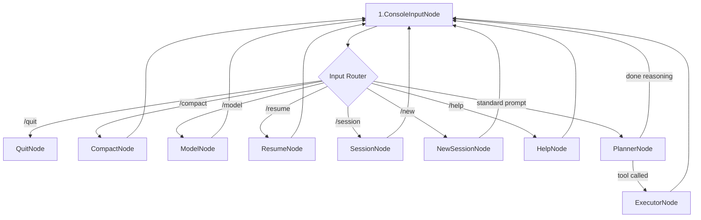

# 🚀 Pocket-Pi: Dynamic Coding Agent (Educational Refactor)


> 🎓 **EDUCATIONAL PURPOSE NOTICE:** This project is designed and maintained strictly for **educational purposes**. The primary core goal of replicating the outstanding TUI layout, exact-replacements editing logic, and tree-based session manager of the original TypeScript-based [pi](https://github.com/earendil-works/pi) coding agent harness is to make its advanced agentic design, tool-calling loops, and contextual workflows **exceptionally easy for Python programmers ("Pythonists") to study, understand, and adapt** using Python packages and the [PocketFlow](https://github.com/The-Pocket/PocketFlow) state-machine framework.

Pocket-Pi maps the core Agent-Tool execution cycle, conversational prompts, tree-based session logging, and interactive slash commands onto a beautifully typed, cyclic PocketFlow graph. It uses `rich` to deliver a gorgeous terminal user experience without unnecessary bloat.

---

## 🏗️ Core Architecture & Flow Diagram

Pocket-Pi is designed completely on top of a state-machine topology. When you run `pocket-pi`, the execution runs through this wired node flowchart:



---

## 🌟 Replicated Pi Core Functionalities

This project is not just a simplified wrapper; it replicates the key architectural highlights that make `pi` exceptionally robust:

1. **Tree-Structured `SessionManager` in Python**: 
   - Sessions are persisted as standard `JSONL` records under `~/.pi/agent/sessions/--<cwd-hash>--/`.
   - Records are organized as a parent-child tree (`id`/`parentId`), enabling branching, navigation, and resume operations in single files.
   - Context building walks backwards from the active `leafId` and handles `CompactionEntry` summary injections and timeline prunings.
2. **Robust Fuzzy-Matching `edit` Tool**:
   - Replicates `pi`'s `applyEditsToNormalizedContent` algorithm.
   - Automatically falls back to character-normalized fuzzy searches if exact replacements fail.
   - Computes lines affected, swaps lines in reverse string order (to preserve character offsets), and restores original BOM and CRLF line endings.
3. **Session Compaction & Thinking Budgets**:
   - Automatically or manually shrinks conversation context windows using clean summarization loops.
   - Incorporates model-specific thinking budgets (supporting Anthropic Claude 3.7 budget tokens structures).
4. **Project Trust**:
   - Asks permission before reading/writing custom `.pi/settings.json` and updates `~/.pi/agent/trust.json`.
5. **Direct Local Bash Executed Commands (`!`)**:
   - Intercepts any inputs starting with `!` or `!!` directly inside `ConsoleInputNode.post()`.
   - Executes commands instantly on your system shell, prints results inside gorgeous, non-blocking Panel frames, and records them in the JSONL database under the official `bashExecution` format—avoiding any API or thread routing latency!

---

## 📚 Embedded Documentation System (Progressive Disclosure)

To allow developers and querying LLM coding assistants to instantly master how the agent handles security, tools, sessions, and configurations, Pocket-Pi ships with its own robust, locally packaged reference library. 

This documentation utilizes a **Three-Tier Progressive Disclosure** layout to ensure optimal clarity without context overload:
1. **Abstraction Level ([`docs/index.md`](docs/index.md))**: A high-level overview detailing document locations and mapping key topics under a unified matrix.
2. **Domain/System Level**: Deep standalone guides outlining active architectures and permission workflows chronologically:
   - [**`docs/architecture.md`**](docs/architecture.md): Declarative state-machine nodes, routers, and cycles.
   - [**`docs/permissions.md`**](docs/permissions.md): CWD directory security trust and permission DB.
   - [**`docs/skills.md`**](docs/skills.md): Local modular prompt extension guidelines and paths.
3. **Low-Level Implementation Schema ([`docs/logging.md`](docs/logging.md))**: Concrete data schemas, system log targets, and transaction layouts (e.g., JSONL models for `toolResult` and `bashExecution`).

---

## 🛠️ Quick Start & Installation

Ensure you have [uv](https://github.com/astral-sh/uv) installed.

### 1. Clone and Install Dependencies
```bash
git clone https://github.com/mbenetti/Pocket-Pi.git
cd Pocket-Pi
uv sync
```

### 2. Configure API Keys
Configure your provider environment variables:
```bash
export ANTHROPIC_API_KEY="sk-ant-..."
# or
export OPENAI_API_KEY="sk-proj-..."
```

### 3. Run the Coding Agent
Launch the interactive terminal:
```bash
uv run pocket-pi
```
*(Alternatively, you can install it globally inside your environment via `uv tool install .` or `pip install -e .` and just run `pocket-pi` from any of your project directories!)*

---

## 💬 Command Reference Guide

Toggle advanced administrative setups directly in the prompt editor using simple slash inputs:

| Slash Command | Detailed Action |
|:---|:---|
| `/new` | Resets tree state and starts a completely fresh conversation branch. |
| `/resume` | Dynamically scans and lets you choose from your previous sessions. |
| `/model` | Swaps default providers (Anthropic <=> OpenAI), selects custom models, or adjusts thinking budgets. |
| `/session` | Details current JSONL stats, cost summaries, and active leaf identifier. |
| `/compact` | Compresses previous context blocks into a single summary paragraph. |
| `/help` | Explains available shortkeys and shortcuts. |
| `/quit` | Gracefully closes connections and leaves the harness. |

### 💻 Direct Local Bash Executions
You can also execute raw shell commands directly on your machine without triggering the LLM:

| Prefix | Behavior |
|:---|:---|
| `!command` | Executes `command` on your system shell, prints results, and retains the execution turn inside your session history so subsequent LLM calls are aware of it. |
| `!!command` | Executes `command` on your system shell, prints results, but **excludes** this turn from the LLM’s conversation context to save key tokens! |

---

## 📂 Codebase File Map

- **`pocket_pi/config.py`**: Settings loader (`settings.json`), proxy overrides, project trust registry.
- **`pocket_pi/session.py`**: Node-tree session tracking, JSONL file loader, chronological root path, and compaction context builder.
- **`pocket_pi/tools/`**: Core filesystem and subprocess functions:
  - `read.py`: Bounds-checked slice reads.
  - `write.py`: File creation with standard parent checks.
  - `edit.py`: String normalization, fuzzy mapping, line ending restoration.
  - `bash.py`: Subprocess process execution with output accumulation limits (2000 lines max).
- **`pocket_pi/workflow/`**: PocketFlow nodes & routing structures:
  - `utils.py`: OpenAI/Anthropic client routing adapter.
  - `nodes.py`: Game steps (ConsoleInput, Planner, Help, Resume, Model, Executor, etc.).
  - `flow.py`: Declarative wiring connecting nodes together.
- **`pocket_pi/main.py`**: Global starting package loader and TUI launcher.
