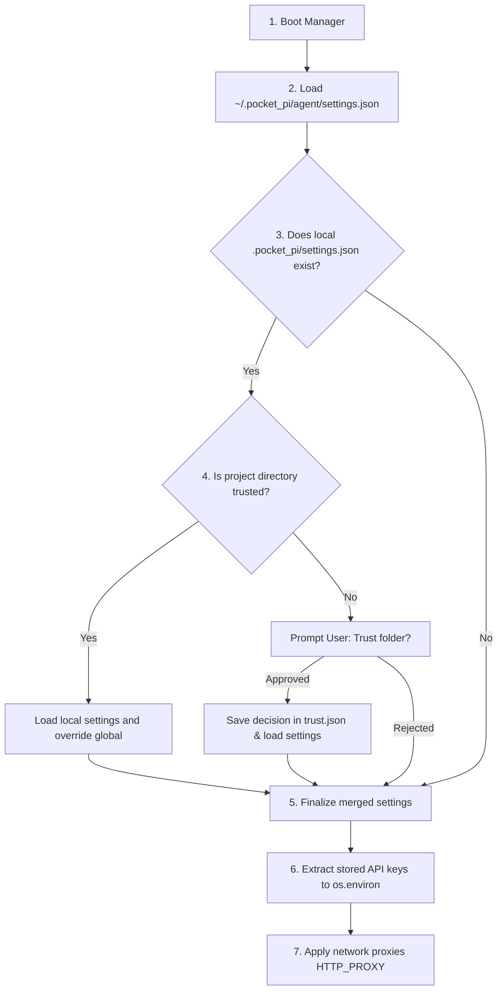

# Module 2: Config & Project Trust Manager

This module details how pocket-pi loads hierarchical configurations, authenticates credentials securely without exposure, manages project folder security boundaries, and tracks transition states silently behind the scenes.

---

## 🏗️ Technical Architecture of `config.py`

When pocket-pi bootstraps, it instantiates a single `ConfigManager` instance. It handles hierarchical JSON operations, setting environments proxies, and evaluating directory boundaries:



---

## 🔑 Deep Dive: Managing Credentials Securely

In original `pi`, typing `/login` lets the user select their provider and securely inputs their API keys. In pocket-pi, we replicate this elegantly by integrating our credential store directly into our global settings file:

```python
    def save_provider_key(self, provider: str, api_key: str):
        # 1. Update active memory settings dictionary
        if "providers" not in self.settings:
            self.settings["providers"] = {}
        if provider not in self.settings["providers"]:
            self.settings["providers"][provider] = {}
        self.settings["providers"][provider]["apiKey"] = api_key
        
        # 2. Persist the credentials globally to ~/.pocket_pi/agent/settings.json
        self.global_dir.mkdir(parents=True, exist_ok=True)
        global_data = {}
        if self.global_config_path.exists():
            try:
                with open(self.global_config_path, "r", encoding="utf-8") as f:
                    global_data = json.load(f)
            except Exception:
                pass
                
        if "providers" not in global_data:
            global_data["providers"] = {}
        if provider not in global_data["providers"]:
            global_data["providers"][provider] = {}
        global_data["providers"][provider]["apiKey"] = api_key
        
        with open(self.global_config_path, "w", encoding="utf-8") as f:
            json.dump(global_data, f, indent=2)
            
        # 3. Dynamic activation: seeding keys straight into environment variables
        self.load_provider_keys_to_env()
```

#### Seeding Environment Variables:
```python
    def load_provider_keys_to_env(self):
        providers = self.settings.get("providers", {})
        for provider, data in providers.items():
            if isinstance(data, dict) and "apiKey" in data:
                # Converts e.g. "openrouter" key to "OPENROUTER_API_KEY"
                env_var_name = f"{provider.upper()}_API_KEY"
                os.environ[env_var_name] = data["apiKey"]
```
This is extraordinarily clean: keys are safely encrypted/hidden inside terminal inputs (using `getpass`), stored consistently inside JSON configurations, and dynamically fed into environment variables on startup. The LLM nodes never have to worry about authentication details!

---

## 🛡️ Project Trust: Sandboxing Local Directory Settings

Local project directories can contain custom `.pocket_pi/settings.json` that might override defaults, or contain custom terminal skills. Executing untrusted local code is a severe safety risk for terminal agents!

Pocket-pi resolves this by implementing a **Project Trust boundary**:

```python
    def is_project_trusted(self) -> bool:
        # 1. Read global default trust settings
        if self.settings.get("defaultProjectTrust") == "always":
            return True
        if self.settings.get("defaultProjectTrust") == "never":
            return False
            
        # 2. Check saved trust records inside ~/.pocket_pi/agent/trust.json
        trust_db = {}
        if self.trust_file_path.exists():
            try:
                with open(self.trust_file_path, "r", encoding="utf-8") as f:
                    trust_db = json.load(f)
            except Exception:
                pass
                
        cwd_str = str(self.cwd)
        return bool(trust_db.get(cwd_str, False))
```

If the project folder is untrusted and `defaultProjectTrust` is `"ask"` (default), the `ConfigManager` pauses bootstrapping and draws a trust panel, asking the developer to confirm folder authorization before proceeding:

```python
    def ask_and_save_project_trust(self) -> bool:
        # Draw panels using rich console ...
        choice = input("Trust folder? (y/n): ").strip().lower()
        decision = choice.startswith("y")
        
        # Persist to trust database
        trust_db[str(self.cwd)] = decision
        with open(self.trust_file_path, "w", encoding="utf-8") as f:
            json.dump(trust_db, f, indent=2)
            
        return decision
```

---

## 📡 Silent Logging: The Sovereign `log_debug`

When drawing complex Panels and Markdown boxes using `rich` on stdout, any direct, standard print statements (`print()`) executed in the background will **corrupt TUI borders, causing terminal line scrambling**.

To solve this, pocket-pi implements **Dynamic Silent Logging** via `log_debug`:

```python
def log_debug(message: str):
    log_dir = Path(".pocket_pi")
    log_dir.mkdir(parents=True, exist_ok=True)
    log_file = log_dir / "pocket-pi-debug.log"
    
    timestamp = time.strftime("%Y-%m-%d %H:%M:%S")
    try:
        with open(log_file, "a", encoding="utf-8") as f:
            f.write(f"[{timestamp}] {message}\n")
    except Exception:
        pass
```

Instead of spamming stdout, nodes write background transition logs to `.pocket_pi/pocket-pi-debug.log`. You can observe the flow live in a separate terminal:
```bash
tail -f .pocket_pi/pocket-pi-debug.log
```

---

## 👩‍💻 Exercises for Students

1.  **Thinking Level Budgets**: Study `ConfigManager.thinking_budget`. Adding a new thinking level of `"max"` that returns `131072` tokens in the budget dictionary.
2.  **Telemetry Toggle**: Create a boolean helper property `is_analytics_enabled` that reads `enableAnalytics` from settings. Write a test case that turns off debugging files if standard internet analytics options are toggled.

---

Next, study how conversational branches are stored as JSONL trees in **[Module 3: Tree-based Session Manager](03_tree_session_manager.md)**! 🌲
