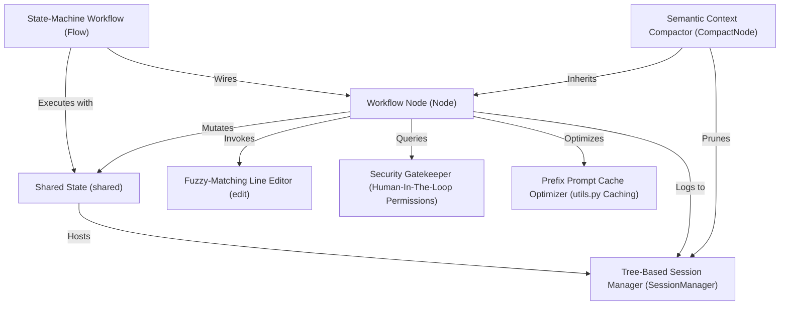

# Tutorial: Pocket-Pi

Pocket-Pi is an educational, interactive coding agent terminal harness structured entirely on top of a deterministic, cyclic state-machine workflow using *PocketFlow*. It coordinates user input routing, LLM planner queries, and tool executions. Key technical pillars include a **tree-structured JSONL session database** for conversation branching, an exceptionally resilient **fuzzy-matching line editor**, a **human-in-the-loop permission gatekeeper** to monitor executable actions, and optimized **symmetrical prefix promt caching** to achieve massive cost and latency reductions.

**Source Repository:** https://github.com/mbenetti/Pocket-Pi.git

<h2>Chapters</h2>

1. [Shared State (shared)](01_shared_state_shared_.md)
2. [Workflow Node (Node)](02_workflow_node_node_.md)
3. [State-Machine Workflow (Flow)](03_state_machine_workflow_flow_.md)
4. [Tree-Based Session Manager (SessionManager)](04_tree_based_session_manager_sessionmanager_.md)
5. [Fuzzy-Matching Line Editor (edit)](05_fuzzy_matching_line_editor_edit_.md)
6. [Security Gatekeeper (Human-In-The-Loop Permissions)](06_security_gatekeeper_human_in_the_loop_permissions_.md)
7. [Semantic Context Compactor (CompactNode)](07_semantic_context_compactor_compactnode_.md)
8. [Prefix Prompt Cache Optimizer (utils.py Caching)](08_prefix_prompt_cache_optimizer_utils_py_caching_.md)

---
Generated by Pi Tutorial Builder Extension : https://github.com/mbenetti/pi-tutorial-builder.git