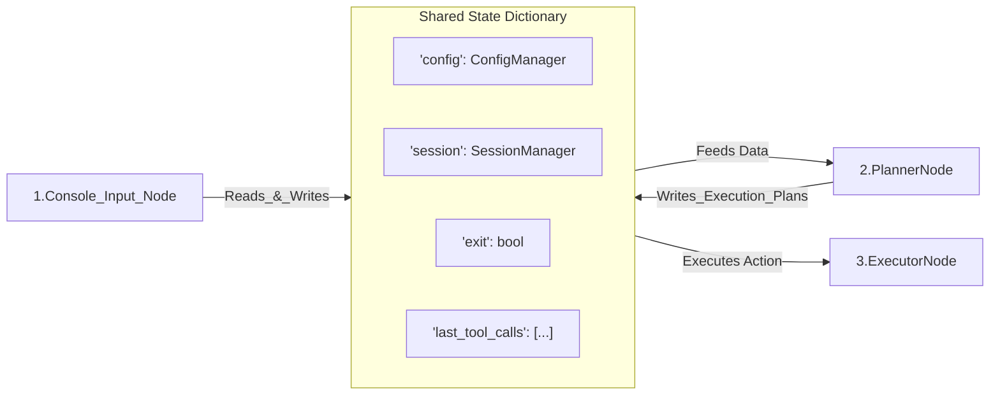

# Chapter 1: Shared State (shared)

Welcome to the architectural blueprint of **Pocket-Pi**, a developer-centric coding agent harness built using the **PocketFlow** state-machine orchestration framework. If you have ever attempted to build production-grade agentic loops using purely linear scripts, you have likely run into spaghetti orchestration, brittle exception recovery, and complex variable scoping across active file paths.

Pocket-Pi solves this by organizing individual execution phases into discrete, reusable **Nodes** coordinated by a **Flow**. But for these isolated nodes to collaborate, they require a central backbone. In Pocket-Pi, that backbone is the **Shared State** (often referenced in the codebase simply as `shared`). 

---

## 🏛️ The Architecture of Shared State

In high-performance system design, passing message envelopes across isolated tasks can introduce significant serialization overhead. For example, in **Apache Airflow**, tasks exchange state metadata via **XComs**, which typically serialize payloads to an external relational database (like PostgreSQL). While robust across distributed machines, this model adds latency and complexity for local execution.

Pocket-Pi utilizes an in-process, single-source-of-truth model. The `shared` object is a standard, mutable Python dictionary passed reference-by-reference down the workflow graph. 

Think of it as a central **system bus** or **CPU register grid** in hardware architecture. No single component monopolizes the bus; instead, every subsystem (Node) taps into the lines, reads configuration values, inspects session tracks, and writes execution outputs for downstream nodes to process:



---

## 🔧 Bootstrapping the Shared State

The `shared` dictionary is instantiated once during application bootstrapping in `pocket_pi/main.py`. This lifecycle occurs before the state machine environment begins routing.

```python
# Bootstrapping the context store
shared = {
    "config": config,
    "session": session,
    "exit": False
}
```
*Why this works*: Here, `shared` is initialized with critical system boundaries. Setting `"exit": False` provides an out-of-band signaling mechanism that any terminal node can toggle to safely shut down the orchestrator.

This configuration is passed directly to the flow engine:

```python
# Launching the state machine flow
flow = PiAgentFlow()
flow.run(shared)
```
*Why this works*: The orchestrator runs synchronously, routing the unmodified reference of `shared` through every node's execution pipeline.

---

## ⚡ The Lifecycle of `shared` within a Node

Every PocketFlow `Node` implements a strict three-phase sequence to manipulate and read the state dictionary: `prep()`, `exec()`, and `post()`. 

To maintain isolation, only certain phases are permitted to touch the `shared` dictionary. Underneath, we enforce strict access rules to prevent side effects during concurrent processing.

### Phase 1: Read-Only Extraction (`prep`)
The `prep()` method is completely read-only. It selects only the specific values required for execution.

```python
# Safely extracting path parameters in context
def prep(self, shared):
    return shared["session"].cwd
```
*Why this works*: By extracting parameters from `shared` here, the computationally intensive `exec()` method remains isolated, making unit testing straightforward.

### Phase 2: Isolated Execution (`exec`)
The `exec()` method performs heavy side-effects, such as calling LLM endpoints, runniing terminal sub-processes, or querying APIs.

```python
# Isolated system execution
def exec(self, cwd):
    return run_tool("ls", {}, cwd=cwd)
```
*Why this works*: Notice that `exec` has **no access** to the global `shared` dictionary. This boundary isolates network/IO operations and prevents race conditions.

### Phase 3: Writing Transitions (`post`)
Once the computational phase resolves, the results are committed back to the state dictionary inside `post()`.

```python
# Committing execution outputs safely
def post(self, shared, prep_res, result):
    shared["last_response"] = result
    return "loop"
```
*Why this works*: Only `post()` is authorized to modify the keys of the `shared` dictionary. Here, we write the tools' outputs and return a routing action string like `"loop"`.

---

## ⚠️ Architectural Hazards: Thread Safety and Reference Integrity

Because `shared` is a plain Python dictionary passed by reference, software architects must observe two strict structural patterns:

1. **Do Not Reassign `shared`**: Passing a new dictionary like `shared = {}` inside a node breaks the outer scoping reference. Always manipulate key-value paths in-place (e.g., `shared["key"] = value`).
2. **Never Return the Dictionary**: The `post()` method must return a routing action string (such as `"default"` or `"loop"`). Returning the dictionary itself will trigger a fatal `TypeError: unhashable type: 'dict'` inside of PocketFlow’s internal successor router.

Now that we understand how the centralized `shared` dictionary serves as our system control bus, we can look at the discrete processing blocks that consume this state. Proceed to **[Chapter 2: Workflow Node (Node)](02_workflow_node_node_.md)** to build your first logical processor!

---
Generated with Pi Tutorial Builder.