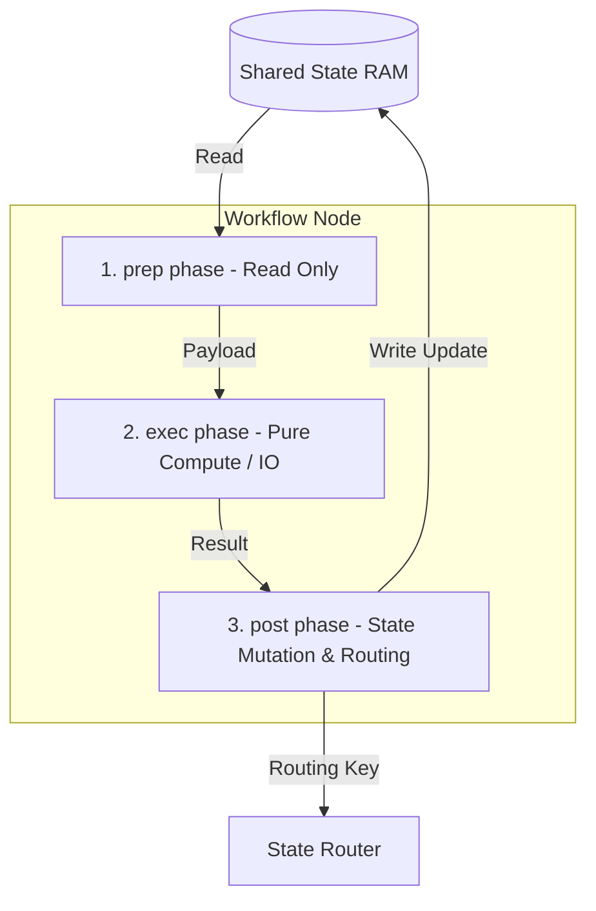

# Chapter 2: Workflow Node (Node)

In [Chapter 1: Shared State (shared)](01_shared_state_shared_.md), we explored the memory bus of the Pocket-Pi agent—the `shared` dictionary. If the Shared State represents system RAM, the **Workflow Node (`Node`)** is the application CPU. It is the isolated, deterministic transaction processor that acts on that memory.

To build interactive, fault-tolerant AI agents (such as terminal assistants, automated code editors, or planning systems), you cannot rely on monolithic, stateful spaghetti loops. Instead, Pocket-Pi models each phase of execution as an independent `Node` subclass. This architectural pattern enforces clean segregation of concerns, ensuring that side effects, LLM API calls, and local shell runs are highly testable, fully isolated, and predictable.

---

## 🏛️ The Node Paradigm: Pipelines and Schedulers

In modern enterprise architectures, frameworks like **Apache Airflow**, **Temporal**, and **AWS Step Functions** decompose complex jobs into stateless tasks or activities. Similarly, a Pocket-Pi `Node` behaves like a stage in a compiler pipeline or a hardware assembly workstation:



At any given workstation, the worker does three things in absolute order:
1. **Gathers materials** from the shared table (`prep` phase).
2. **Performs the work** in complete isolation (`exec` phase).
3. **Places changes back** onto the shared table and signals where the item must go next (`post` phase).

This strict execution lifecycle prevents parallel execution corruption, simplifies debugging, and allows writing pure unit tests for the core business logic without mocking complex runtime state.

---

## ⚙️ The Three-Phase Node Lifecycle

Every step in a Pocket-Pi state machine subclasses the base class `pocketflow.Node` and implements three crucial methods: `prep`, `exec`, and `post`.

Let us break down each of these execution boundaries.

### 1. The Prep Phase: Input Extraction

The `prep` phase is read-only. Its sole responsibility is to extract whatever specific payload is required from the global `shared` state, format those variables, and return them.

```python
def prep(self, shared):
    # Extract only the required key, keeping shared read-only
    return shared.get("user_input")
```
The dictionary configuration is isolated here. This function returns a simple payload string containing the raw user command, shielding downstream processing from the dictionary structure itself.

### 2. The Exec Phase: Pure Compute and I/O Execution

The `exec` phase receives the payload returned by `prep`. It represents the actual processing core. Crucially, **`exec` has no access to the `shared` dictionary**. It cannot read from or write to other keys of the execution context, preventing accidental side effects during LLM roundtrips, database queries, or external tool execution.

```python
def exec(self, prompt):
    # Perform isolated computation, such as calling an LLM
    return f"Processed prompt: {prompt}"
```
Because this phase depends only on input parameters and returns a single output value, you can easily unit-test the execution logic of your LLM agents without instantiating or mocking the global system state.

### 3. The Post Phase: State Mutation and Routing

The `post` phase receives three arguments: the global `shared` dictionary, the payload returned by `prep`, and the computation results returned by `exec`. This is the only phase where mutations to the `shared` dictionary are permitted, and it **must** return an action string defining where the workflow should go next.

```python
def post(self, shared, prep_res, response):
    # Apply changes to state and return a routing action
    shared["processed_response"] = response
    return "default"
```
The string returned by `post` (e.g., `"default"`) acts as the signal used by the state-machine workflow orchestrator to transition to the next step.

> ⚠️ **Critical Rule**: `post()` must return a string action key (like `"default"`, `"success"`, or `"retry"`). Never return the `shared` dictionary itself, as this breaks state-machine routing.

---

## 💻 Case Study: The In-Node Router Pattern

In terminal-based developer agents, speed is critical. In Pocket-Pi, starting an input prompt with an exclamation mark (such as `!ls -la` or `!!pip install rich`) triggers a local system shell command directly.

A naive workflow design might transition state to a separate `ShellNode`. However, this introduces context mobilization latency. Pocket-Pi solves this by using the **In-Node Router Pattern** inside the `post` phase of the `ConsoleInputNode`:

```python
if user_input.startswith("!"):
    command = user_input.lstrip("!")
    output = run_tool("bash", {"command": command})
    return "input_again"
```
By intercepting commands starting with `!` inside the `post` phase of the input reader, the system can execute fast local subprocesses and return `"input_again"` to loop back immediately. This avoids state disruption, bypasses the LLM planner, and keeps interface response times under a millisecond.

---

## 🚀 Transitioning to the Next Phase

Now that we understand how individual execution steps are isolated into predictable, testable `Node` containers, we need to explore how to wire them together.

Proceed to [Chapter 3: State-Machine Workflow (Flow)](03_state_machine_workflow_flow_.md) to see how individual nodes are connected using declarative operators to build resilient, looping agentic graphs!

---
Generated with Pi Tutorial Builder.