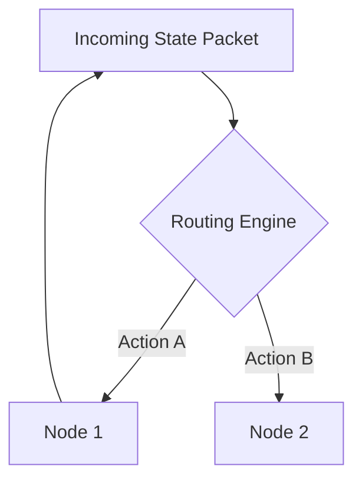
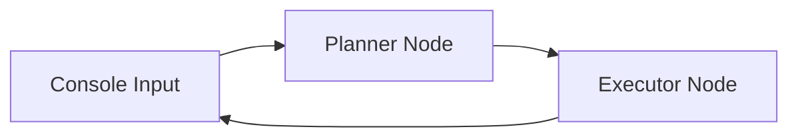
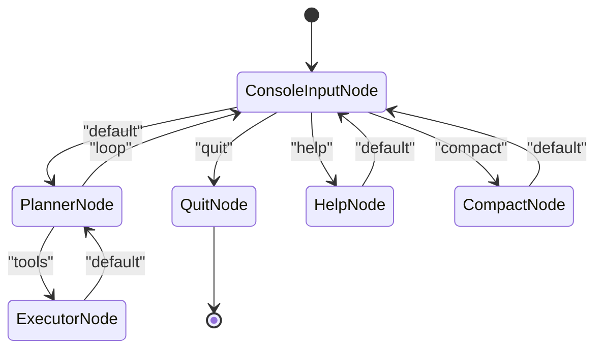

# Chapter 3: State-Machine Workflow (Flow)

In [Chapter 2: Workflow Node (Node)](02_workflow_node_node_.md), we explored how to isolate discrete operational tasks into unified, testable sub-units. We codified our execution steps into standalone objects with distinct operational boundaries: `prep`, `exec`, and `post`. 

However, a collection of decoupled nodes is static. Without an orchestrator, these nodes cannot share state or repeat execution steps. We need a system director to turn these independent classes into a cohesive, cyclic runtime network. 

The `PiAgentFlow` class—subclassed from `pocketflow.Flow`—acts as this central coordinator. It maps state transitions dynamically, routes commands, manages autonomous tool-execution loops, and prevents system crashes by managing the execution life cycle.

---

## Technical Analogy: The Network Switchboard

Instead of thinking of execution as a linear script with nested `while` blocks and deeply coupled conditional statements, think of `pocketflow.Flow` as a **Layer 3 Network Switch with Policy-Based Routing (PBR)**. 



In a network switch, incoming data packets (the [Chapter 1: Shared State](01_shared_state_shared_.md)) are analyzed at the ingress port. The switch's routing table (the Flow wiring diagram) directs the state packet to an egress port (the successor `Node`) based on policy headers (the action strings returned by `post()`).

In industry-standard software architectures, this mirrors statechart engines like **XState**, distributed micro-orchestrators like **temporal.io**, or directed acyclic graph (DAG) managers like **Apache Airflow**. While Airflow excels at long-running batch sequences, PocketFlow is optimized for high-frequency, cyclic state-machine loops running in real time.

---

## Declarative Graph Wiring

In `pocket_pi/workflow/flow.py`, we construct the graph structure of our agent inside the `__init__` constructor of `PiAgentFlow`. Let's look at how we declare and configure these states.

```python
class PiAgentFlow(Flow):
    def __init__(self):
        # 1. Instantiate independent state nodes
        console_input = ConsoleInputNode()
        planner_node = PlannerNode()
        executor_node = ExecutorNode()
```
*Explanation of code block*: We inherit core graph capacities from `pocketflow.Flow` and instantiate our custom nodes. These nodes are not yet connected; they exist as isolated processing stations.

To connect nodes, we use the default successor operator (`>>`).

```python
# Wire an unconditional successor link
executor_node >> planner_node
```
*Explanation of code block*: The right-shift operator (`>>`) joins two nodes together. By default, when `executor_node` completes and returns `"default"` from its `post()` method, control shifts directly to `planner_node`.

When branching depends on dynamic execution states, we use the conditional connection operator (`-`).

```python
# Route depending on the string action returned
console_input - "default" >> planner_node
console_input - "quit" >> quit_node
```
*Explanation of code block*: The minus operator (`-`) associates a specific return action with a downstream node. If `console_input.post()` evaluates to `"quit"`, the transition table routes execution to the exit wrapper, `quit_node`. If it evaluates to `"default"`, control flows to the model planner.

---

## The Cyclic Feedback Hook

A common architectural trap when building agent interfaces is wiring tool execution directly back to user input, like so:



This sequence breaks the agent's observation process. The model executes a system call (like writing a file), but control is handed back to the user before the model can inspect the result of that action. 

`pocket_pi` solves this by forming a tight, autonomous feedback loop between `PlannerNode` and `ExecutorNode`:

```python
# Create the loop
planner_node - "tools" >> executor_node
executor_node >> planner_node
```
*Explanation of code block*: When the model needs to call a tool, it outputs a list of action items, routing the flow to the `executor_node`. Once execution completes, the flow routes **back** to `planner_node` without user intervention. This allows the model to process the tool results, verify success, and plan subsequent steps.

Here is how the complete state machine is structured:



---

## Inside the Flow Execution Engine

When you trigger `flow.run()`, the underlying runtime processes the graph structure through a deterministic engine cycle.

```python
# Initialize and launch the orchestration loop
shared_state = {"config": config, "session": session}
flow = PiAgentFlow()
flow.run(shared_state)
```
*Explanation of code block*: We pass a mutable dictionary (`shared_state`) to the flow executor. The engine registers this dictionary as the primary context store, targets the starting node configured via `super().__init__(start=console_input)`, and enters the loop.

During each cycle, the execution engine performs these operations:

1. **Parameters Preparation**: The active node's `prep()` method runs, extracting localized data from the mutable context dictionary.
2. **Computational Guarding**: The node's `exec()` method isolates compute operations, keeping external API calls and system tasks clean.
3. **State Integration**: The node's `post()` method executes, updating global keys inside the shared dictionaries.
4. **Action Resolution**: The string returned by `post()` is scanned against the node's routing definitions. The match determines the successor node, which is then prepared for the next turn.

If a node returns an action that points to no configured successor, the engine terminates processing and returns control to the host process.

---

Now that our state machine can route sequences and execute loops, we need a way to manage conversation history. LLM engines require persistent records of user inputs, model responses, and tool executions. However, standard linear list structures make it difficult to explore alternate tool execution paths, handle context windows efficiently, or resume past states.

In [Chapter 4: Tree-Based Session Manager (SessionManager)](04_tree_based_session_manager_sessionmanager_.md), we will explore how `pocket_pi` structures conversation details into a hierarchical branching system.

---
Generated with Pi Tutorial Builder.