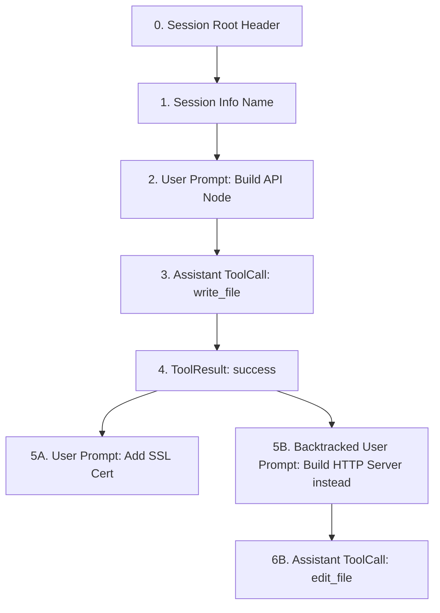
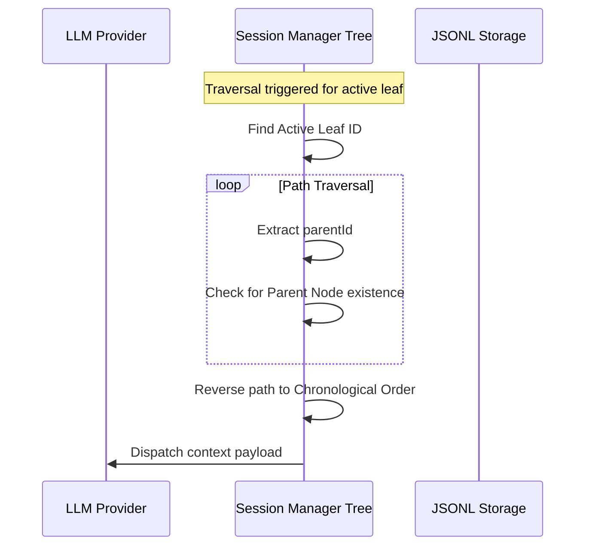

# Chapter 4: Tree-Based Session Manager (SessionManager)

In [Chapter 3: State-Machine Workflow (Flow)](03_state_machine_workflow_flow_.md), we established how individual state transitions execute in a deterministic cycle. While the `Flow` governs system mechanics, a production-grade coding agent requires an immutable, resilient ledger to safely log active conversations and tool actions. 

When generating changes across large codebases, linear chat historical vectors are highly fragile. If a reasoning loop derails, an engineer needs to backtrack to an earlier point in the conversation and try an alternative approach. In a standard linear setup, rolling back means permanently destroying all subsequent messages.

Pocket-Pi solves this vulnerability by replacing flat timeline arrays with a graph-based **Tree-Based Session Manager (`SessionManager`)** implemented in `pocket_pi/session.py`. This system acts as a transactional version-control store for agent context.

---

## 🌲 The Flaws of Chronology vs. Tree-Based Branching

In traditional software design, databases often store log records sequentially. However, in interactive agent environments, linear indexing causes data loss during context rolls. 

Imagine editing a source file using a standard compiler. If the compile stage crashes, you do not throw away the repository history; instead, you restore a previous checkout commit and launch a clean branch. Pocket-Pi ports this git-like branching strategy directly to LLM sessions.

Every turn has its own distinct transaction block containing a unique resource identifier (`id`) and a reference pointer to its predecessor (`parentId`). This forms a directed tree layout:



When backtracking occurs, the `SessionManager` updates an active pointer to point back to an alternative parent ID. This isolates invalid reasoning executions onto dead, non-referenced branches, preserving historical branches intact on the hard disk.

---

## 💾 Under the Hood: The JSONL Ledger

Database configurations in Pocket-Pi are saved inside a private system folder in your user directory: `~/.pocket_pi/agent/sessions/--<cwd-hash>--/`.

To establish a stable, low-latency datastore that survives crash states, `SessionManager` utilizes a line-delimited JSON format (**JSONL**). This mimics database **Write-Ahead Logging (WAL)**. Real-time updates append directly to the end of the telemetry document, bypassing full-file rewrites.

During startup, the system parses the Current Working Directory (CWD) path to locate the target project record folder:

```python
cwd_dir_name = "--" + str(self.cwd).replace("/", "-").replace("\\", "-").strip("-") + "--"
self.project_session_dir = self.session_dir / cwd_dir_name
```
*Why this works*: The directories are separated explicitly per project path. This shields active session histories across disjoint workspaces from bleed-through.

To record execution events, the ledger appends serialized events directly to disk:

```python
def _write_entry(self, entry: Dict[str, Any]):
    entry_id = entry["id"]
    self.entries[entry_id] = entry
    self.entries_ordered.append(entry_id)
    with open(self.session_file, "a", encoding="utf-8") as f:
        f.write(json.dumps(entry) + "\n")
```
*Why this works*: Opening files under append mode (`"a"`) guarantees O(1) disk-write metrics. If an unhandled exception or power failure occurs mid-turn, previous tree configurations remain uncorrupted.

---

## 🧭 Traversing the Tree Path Chronologically

Because API endpoints require chronological histories, we cannot feed raw non-linear graphs directly to model providers. When presenting state frames, the manager performs a backward trace from the leaf node up to the root, resolving an ordered timeline.



We traverse nodes sequentially from leaf to root, using cycle protection safeguards:

```python
def get_path_to_root(self, leaf_id: Optional[str] = None) -> List[Dict[str, Any]]:
    curr_id = leaf_id or self.current_leaf_id
    path, visited = [], set()
    while curr_id and curr_id not in visited:
        visited.add(curr_id)
        entry = self.entries.get(curr_id)
        if not entry: break
        path.append(entry)
        curr_id = entry.get("parentId")
    return list(reversed(path))
```
*Why this works*: The loop detects cycles by storing visited keys, guarding against infinite loops in corrupted files. Reversing the finalized list restores chronological order.

---

## 📦 Context Compaction & LSM Compaction Barriers

As conversation turns grow, raw payload trees eventually conflict with LLM context windows. To address this, Pocket-Pi deploys a context compaction routine. This design mirrors key-merging structures found in Log-Structured Merge Trees (**LSM Trees**), such as those in Apache Cassandra or RocksDB.

Instead of keeping every message, the engine collapses old historical arrays into a single `CompactionEntry` node containing an LLM-generated summary.

When compiling prompts, `SessionManager` scans the resolved path from oldest to newest:

```python
compaction_entry = None
for entry in reversed(path):
    if entry.get("type") == "compaction":
        compaction_entry = entry
        break
```
*Why this works*: Starting from the back lets the parser locate the most recent compaction boundary on the active branch, discarding obsolete summaries.

Once a compaction boundary is identified, history elements preceding the `firstKeptEntryId` are dropped from the active runtime payload:

```python
def filter_kept_path(path, compaction_entry):
    keep = False
    for entry in path:
        if entry["id"] == compaction_entry["firstKeptEntryId"]:
            keep = True
        if keep and entry["id"] != compaction_entry["id"]:
            yield entry
```
*Why this works*: This acts as a logical barrier. It safely filters out old nodes while conserving context tokens. It then mounts the text-summarized system prompt chunk before appending the remaining un-compacted nodes.

---

## 🔄 Mapping Rich Entries to API Format

Another challenge resides in converting deep-nested tool trees (such as system subprocess calls and file reads) into flat JSON specifications expected by LLM services like Anthropic and OpenAI.

For tool call queries, the assistant role converts nested blocks back into functional completion parameters:

```python
# Processing tool conversions inside serialize engine
elif role == "assistant":
    tool_calls = [{
        "id": b["id"], "type": "function",
        "function": {"name": b["name"], "arguments": json.dumps(b["arguments"])}
    } for b in content if b.get("type") == "toolCall"]
    return {"role": "assistant", "content": text_content, "tool_calls": tool_calls}
```
*Why this works*: It isolates internal state representations from external integrations, rendering clean tool calls that standard endpoints can easily process.

After execution, the downstream tool context result map links back to the call ID:

```python
elif role == "toolResult":
    return {
        "role": "tool",
        "tool_call_id": msg_obj.get("toolCallId") or "unknown_id",
        "content": text_content
    }
```
*Why this works*: Matching raw return payloads with `tool_call_id` ensures the LLM's attention mechanism associates values back to their original requests.

---

## 🔀 Active Branch Navigation

To switch between active branches or roll back the state machine layout, we update `self.current_leaf_id`. This instantly changes what information is visible to downstream systems.

```python
def branch_to(self, entry_id: str):
    if entry_id not in self.entries:
        raise ValueError("Entry does not exist.")
    self.current_leaf_id = entry_id
```
*Why this works*: By changing a single pointer reference, we safely relocate the active conversation state. This avoids manual deletion sweeps across the database.

---

## 🧪 Developer Exercises

1. **Interactive Branch Restoration**: Build a method `get_branches(self) -> List[str]` that scans the current database entries and returns any terminal leaf nodes that are no longer path ancestors of `current_leaf_id`. This helps users find and recover hidden conversational paths.
2. **Metadata Recovery Guard**: Write a protection filter inside `load_session` to detect mismatched parent keys, automatic recovery routines, or un-parsable lines. This ensures the app can always start up, even if a user manually modifies their `~/.pocket_pi` files.

---

Now that our session engine can track active, branching conversation state, we need tools capable of making precise workspace edits. Proceed to **[Chapter 5: Fuzzy-Matching Line Editor (edit)](05_fuzzy_matching_line_editor_edit_.md)** to build our core codebase modifier tool!

---
Generated with Pi Tutorial Builder.