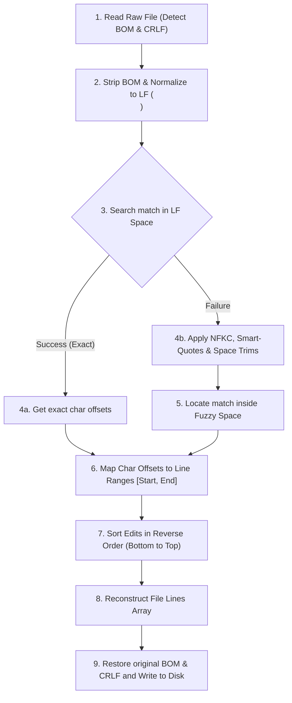
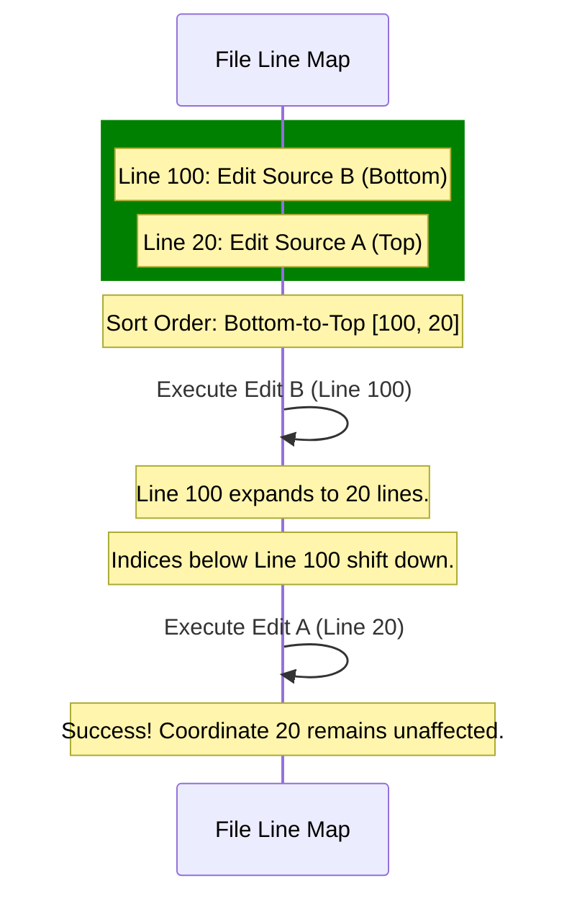

# Chapter 5: Fuzzy-Matching Line Editor (edit)

In [Chapter 4: Tree-Based Session Manager (SessionManager)](04_tree_based_session_manager_sessionmanager_.md), we implemented a multi-branch tree to organize our message history and enable robust session traversal. However, capturing structural ideas in a session tree is only half the battle. The logical endpoint of any developer agent is the physical workspace: the files, code modules, and configuration blueprints.

When an LLM attempts to write code, replacing a 1,000-line file to change a single line wastes expensive tokens and introduces execution latency. Conversely, traditional search-and-replace solutions of simple text blocks fail when encountering carriage return differences, trailing tail-spaces, or Unicode quotation variations. 

This chapter covers the architecture of **Pocket-Pi’s `edit` tool**, a line-preserving, fuzzy-matching editor inspired by the exact-match engine in the original TypeScript-based [pi](https://github.com/earendil-works/pi) agent harness.

---

## 🏛️ The Architecture of Surgical Code Modifications

In compiler architecture, when a optimization pass modifies a Syntax Tree (such as in the **Roslyn Compiler Engine** or **Babel**), it relies on precise token coordinates rather than mutating direct file strings. Similarly, professional workspace editors use a multi-stage translation pipeline to map a fuzzy match into safe, deterministic modifications on exact line records.

To achieve this without breaking untouched regions of the target file, Pocket-Pi treats the editing stage as a visual translation and reverse-indexing pipeline:



This pipeline allows the LLM to provide search targets that are minor approximations of the code on disk. The system translates the document offsets, computes the exact lines affected, performs the modifications in reverse order to protect file indexes, and writes the changes back while preserving original line endings.

---

## 🔧 Step-by-Step Pipeline Mechanics

Let us dismantle the modular phases of our visual compilation pipeline, tracking exactly how string targets isolate and transpose coordinates.

### 1. Unified Carriage Return Termination

Operating systems handle line endings differently: Windows systems historical default is `\r\n` (CRLF), while UNIX-based systems use `\n` (LF). Before we execute any string matching operations, we translate all inputs to UNIX-style line feeds:

```python
def normalize_to_lf(text: str) -> str:
    """Ensure standard LF line endings."""
    return text.replace("\r\n", "\n").replace("\r", "\n")
```
*Why this works*: Standardizing the input text to a single line-ending character (`\n`) simplifies the mathematical offsets computation and avoids mismatch issues caused by different operating system encodings.

---

### 2. Progressive Fuzzy Normalization

If an exact string match is not found on the normalized `LF` representation, the edit tool falls back to a progressive normalization pipeline. It cleans typographical differences, trailing whitespace on blank or indented lines, and Unicode variations:

```python
def fuzzy_unicode_normalize(text: str) -> str:
    """Apply visual normalizations to characters."""
    normalized = unicodedata.normalize("NFKC", text)
    trimmed = [l.rstrip() for l in normalized.split("\n")]
    return "\n".join(trimmed)
```
*Why this works*: The standard Unicode NFKC normalization decomposes and re-composes compatibility characters. Trimming the right side of individual lines removes trailing whitespaces, preventing whitespace issues from causing matching failures.

Next, typographic variations (often introduced by clipboard actions or variations in LLM token outputs) are replaced with standard ASCII symbols:

```python
def clean_smart_characters(text: str) -> str:
    """Replace curly quotes, special dashes and spaces."""
    text = text.replace("\u201C", '"').replace("\u201D", '"')
    text = text.replace("\u2018", "'").replace("\u2019", "'")
    text = text.replace("\u2014", "-").replace("\u00A0", " ")
    return text
```
*Why this works*: Curly visual quotes, long dashes, and non-breaking spaces match their ASCII equivalents, aligning the search pattern with the file contents.

---

### 3. Absolute Paging Offset Maps

In virtual memory architecture, operating systems maintain page tables to translate virtual memory addresses to raw physical RAM addresses. In pocket-pi, we use a similar mapping approach: we map absolute character positions in normalized space to physical line numbers.

The first step is recording the start and end character positions for every line:

```python
def get_line_offsets(content: str) -> List[Tuple[int, int]]:
    """Record character spans for each line."""
    offsets, current = [], 0
    for line in content.split("\n"):
        end = current + len(line)
        offsets.append((current, end))
        current = end + 1
    return offsets
```
*Why this works*: By storing the start and end bounds of every line in a flat array, we can map character indices directly back to their target line index.

Once we have this offset index map, we translate any continuous block match defined by a `(start_char, end_char)` coordinate pair to a discrete range of lines:

```python
def find_target_line_range(offsets: list, start: int, end: int) -> tuple:
    """Map character indices to line positions."""
    s = next(i for i, (b, e) in enumerate(offsets) if start <= e + 1)
    e = s
    for idx in range(s, len(offsets)):
        if offsets[idx][0] <= end:
            e = idx
    return s, e
```
*Why this works*: This method determines exactly which physical lines contain the match, even if the match spans multiple lines or starts mid-line.

---

### 4. Reverse Order Modifications (Bottom-to-Top)

Changing code lines in a file frequently changes the total line count of the document. If you apply replacements starting from the top of the file, any change that adds or removes lines shifts the indices of all remaining matches further down, causing later replacements to target the wrong positions.

This issue is similar to mutating a collection while iterating over it in program execution. Pocket-Pi avoids this by sorting modifications dynamically from the bottom of the document to the top:

```python
# Sort targets in reverse line-index hierarchy
sorted_edits = sorted(replacements, key=lambda x: x[1], reverse=True)
for fuzzy, s_line, e_line, _, new_text, _ in sorted_edits:
    prefix = orig_lines[:s_line]
    suffix = orig_lines[e_line + 1:]
    orig_lines = prefix + new_text.split("\n") + suffix
```
*Why this works*: Sorting the edit points in reverse order ensures that changes to one section of the file do not alter the line coordinates of any pending modifications higher up. This works like pop operations on a stack, keeping all target coordinates stable, as shown in the diagram below:



---

## ⚖️ Comparative Landscape: Pocket-Pi vs Industry Standards

To understand why this design is ideal for developer agents, consider how it compares to existing tool-assisted editing patterns:

| Editing Pattern | Implementation Method | Strengths | Major Operational Weaknesses |
|:---|:---|:---|:---|
| **Whole File Overwrite** | Simple `write` utility. | Straightforward to implement; zero parsing complexity. | High token cost; high latency; risky; prone to context cutoffs on large files. |
| **GNU Diff / Patch** | standard POSIX `patch` mechanism. | Highly structured; widely used in developer environments. | Extremely brittle with spacing changes; issues with line-ending mismatches. |
| **LSP Workspace Edit** | Language Server Protocol edits. | Highly accurate; references concrete AST paths. | Requires running active language servers for every target file environment. |
| **Fuzzy Line Editor** | Visual space mapping + Reverse sorting. | Tolerant to formatting discrepancies; highly accurate; lightweight. | Does not resolve merge conflicts on simultaneous overlapping edits. |

---

## 🚀 Transitioning to the Workspace Permissions

Our fuzzy-matching edit pipeline allows the agent's planner loop to perform surgical modifications to files in the local workspace. However, allowing an automated tool to execute shell sessions or modify local file structures raises a critical security question: *How do we prevent the agent from modifying system-level directories, system path binaries, or sensitive dotfiles?*

In the next chapter, we will build a security gatekeeper to manage directory trust permissions.

Proceed to **[Chapter 6: Security Gatekeeper (Human-In-The-Loop Permissions)](06_security_gatekeeper_human_in_the_loop_permissions_.md)** to secure your workspace against automated actions!

---
Generated with Pi Tutorial Builder.