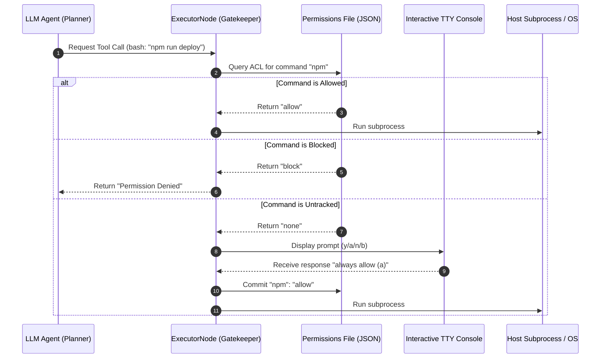

# Chapter 6: Security Gatekeeper (Human-In-The-Loop Permissions)

In [Chapter 3: State-Machine Workflow (Flow)](03_state_machine_workflow_flow_.md), we engineered a resilient, cyclic core loop that enables our planner to dynamically dispatch system instructions to the `ExecutorNode`. However, in autonomous systems architecture, routing high-privilege operations (such as compiling binary targets, mutating files, or query-routing across public APIs) directly to local sub-processes creates a massive vulnerability. If an agent encounters an untrusted repository or experiences hallucination, it could execute destructive commands without system-administrator oversight.

To eliminate this systemic risk, Pocket-Pi integrates a zero-trust **Security Gatekeeper** directly into the state-machine transition pipeline inside the `ExecutorNode` (located in [`pocket_pi/workflow/nodes.py`](pocket_pi/workflow/nodes.py)). It behaves like an in-kernel security monitor, analyzing proposed actions, parsing command arguments, checking localized Access Control Lists (ACLs), and pausing processing to query the human operator when an untracked system call or network request is detected.

---

## 🏛️ The Architecture of Interception

In standard operating systems design, user-space applications cannot interact with hardware devices directly. Instead, they must issue a **system call (syscall)**, which triggers a context switch transferring control to the kernel. Ready-state kernels block and validate the request against strict Access Control Lists (such as **SELinux** or hardware **seccomp** profiles) before executing the instruction.

The `ExecutorNode` replicates this security model inside our virtual runtime. Before executing any tool payload, the `ExecutorNode` acts as an interception firewall. It halts state execution, audits the payload's resource footprint, and verifies permission clearance:



By verifying access rules in the `prep()` phase (before handing payloads to the isolated, high-computation `exec()` phase), the state machine ensures that unauthorized commands never touch the system shell.

---

## 🔍 Parsing System and Network Requests

To validate security policies, the Gatekeeper first parses raw string payloads into discrete structured resources. For example, if the LLM issues a command like `pip install flask && curl https://api.example.com`, the Gatekeeper must identify both the `pip` and `curl` executables, along with the domain name `api.example.com`.

This extraction relies on targeted regular expressions to isolate individual executables and target URLs:

```python
# Split command lines and filter out environment variables
parts = re.split(r' && | \|\| |;|\n', command)
cmds = [p.strip().split()[0] for p in parts if p.strip()]
```
*Why this works*: Splitting the input string by standard shells separators (and, or, semicolons, or newlines) enables the parser to audit nested, multi-stage pipelines independently.

Once split, the system extracts the trailing filename to identify the specific executable:

```python
# Isolate shell command names reliably
executables = list(set(Path(c).name for c in cmds if c))
```
*Why this works*: Using `Path.name` ensures that even absolute Unix path invocations (such as `/usr/bin/git`) resolve to their core logical executables (like `git`), which are then matched against the user's ACL.

Target URLs are extracted through a parallel regex routine:

```python
# Parse out network resource hostnames
pattern = r'https?://[^\s\'"]+'
urls = re.findall(pattern, command)
```
*Why this works*: Finding uniform resource identifiers directly within command arguments lets the Gatekeeper block egress network traffic before the system establishes a socket connection.

---

## 💾 The Local ACL Schema (`permissions.json`)

To prevent constant human-in-the-loop interruption, the Gatekeeper checks local project configurations. Permission profiles are stored inside `.pocket_pi/permissions.json` relative to the current working directory. 

This simple database tracks authorized and blocked resources:

```json
{
  "commands": {
    "git": "allow",
    "rm": "block"
  },
  "urls": {
    "api.tavily.com": "allow"
  }
}
```

This JSON database is parsed and integrated into the active execution context inside `prep()`:

```python
# Loading localized Access Control List mappings
perm_file = Path(cwd) / ".pocket_pi" / "permissions.json"
perms = {"commands": {}, "urls": {}}
if perm_file.exists():
    with open(perm_file, "r") as f:
        perms = json.load(f)
```
*Why this works*: By caching this JSON schema on standard file reads inside `prep()`, the Gatekeeper bypasses prompt interactions for approved items, maintaining sub-millisecond execution speeds for known development routines.

---

## 🚦 Interactive TTY Verification Hooks

When the Gatekeeper detects an unconfigured executable or domain, it triggers a temporary interactive terminal hook. Borrowing from **Kubernetes Validating Admission Webhooks** or the familiar `sudo` interactive prompt, execution halts while the console displays the pending request and asks the user for authorization:

```python
# Prompt user dynamically for authorization
decision = prompt_gatekeeper_choice("Command", cmd)
```
*Why this works*: The interactive prompt blocks further processing in the current thread, isolating the system until a valid decision is registered.

```python
# Commit permanent policies to the local file
perms["commands"][cmd] = "allow"
save_permissions(perm_file, perms)
```
*Why this works*: Writing `"allow"` or `"block"` entries directly back to the project's config ensures the user is prompted only once for each resource type.

The console prompt provides the user with four strategic options:

*   **Allow once (`y`)**: Authorizes the command for the current turn. The resource remains unconfigured in `permissions.json`.
*   **Always allow (`a`)**: Appends `"allow"` to the ACL and runs the operation immediately.
*   **Block once (`n`)**: Aborts the operation and returns a `Permission Denied` log to the Planner Node.
*   **Always block (`b`)**: Commits `"block"` to `permissions.json` and halts execution, preventing this resource from running in future turns.

---

## 🛡️ Defeating Write-Tunneling Attacks

Any system that allows LLMs to write files (`write_file`), edit code (`edit`), or run terminal commands (`bash`) is vulnerable to **privilege escalation**. An intelligent, compromised agent might try to bypass restrictions by writing directly to `.pocket_pi/permissions.json` or running shell operations (such as `echo "allow" > .pocket_pi/permissions.json`) to modify its own security file.

Pocket-Pi prevents this by deploying a hardcoded **Write Shield** inside the underlying execution tools:

```python
# Guard against model attempts to alter security configs
if ".pocket_pi" in command.lower():
    for forbidden in [">", "rm ", "mv ", "chmod ", "tee "]:
        if forbidden in command.lower():
            return "Permission Denied: Modifying config is blocked."
```
*Why this works*: Running checks inside the `execute_bash` module (outside the control of the model or state nodes) ensures the file-writing tools cannot access the configuration folder, maintaining strict security boundaries.

---

Now that our agent's terminal operations are protected by a secure, human-guided gatekeeper, we can safely explore performance optimization. When long reasoning sessions or numerous tool operations occur, the conversation history can quickly exceed context windows and inflate token costs.

Proceed to **[Chapter 7: Semantic Context Compactor (CompactNode)](07_semantic_context_compactor_compactnode_.md)** to explore how Pocket-Pi uses automated LLM summary generation to shrink active memory footprints and keep our workflows highly cost-effective!

---
Generated with Pi Tutorial Builder.