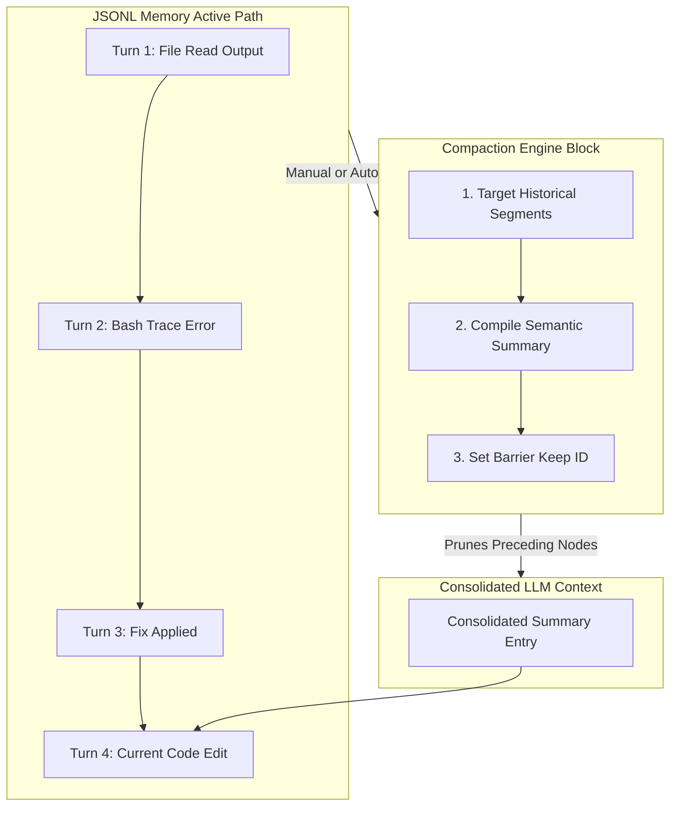
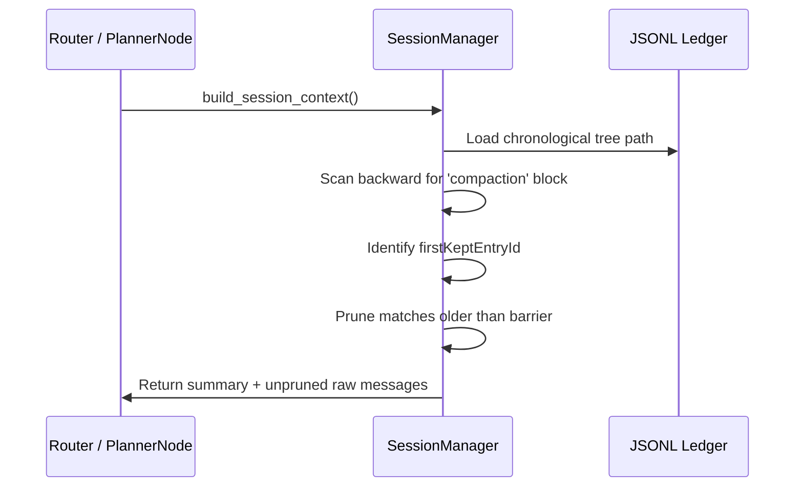

# Chapter 7: Semantic Context Compactor (CompactNode)

In [Chapter 4: Tree-Based Session Manager (SessionManager)](04_tree_based_session_manager_sessionmanager_.md), we implemented a version-controlled database that captures the state of our conversations and tool executions inside a line-delimited JSON (JSONL) ledger. However, as an agent reads files, runs terminal tests, and interacts with users, the sheer volume of text rapidly inflates of the model's active context window. 

Forcing the Language Model to parse thousands of lines of old compiler logs and raw code copies on every turn raises execution costs, introduces latency, and degrades attention accuracy (often called "loss in the middle").

To solve this, Pocket-Pi features the **Semantic Context Compactor (`CompactNode`)**, located in `pocket_pi/workflow/nodes.py`. Much like database checkpoint systems, this state machine node condenses historical dialogue turns into a brief, high-density summary block and prunes outdated operational records, keeping downstream prompts small, responsive, and budget-friendly.

---

## 🏛️ The Engineering Analogy: LSM Tree SSTable Compaction

To understand why simple sliding window algorithms fail, look at how modern storage engines handle active write actions. In Log-Structured Merge Tree (**LSM Tree**) architectures—such as those inside **Apache Cassandra**, **RocksDB**, or **Google LevelDB**—updates are appended directly to write-ahead logs (WAL) and memory tables. To prevent storage fragmentation and uncontrolled disk expansion, background processes periodically run **Compaction**. Compaction merges multiple sorted tables (SSTables), discards outdated keys, and writes unified, consolidated data files:



This is precisely how our `CompactNode` operates. Instead of discarding old history using a raw sliding window (which risks deleting vital context, like previous file paths or user requests), Pocket-Pi consolides older turns into a single high-density summary. It inserts this summary as a checkpoint block, moving the start of active parsing forward to a newly marked target index.

---

## ⚙️ The Compaction Lifecycle

In [Chapter 3: State-Machine Workflow (Flow)](03_state_machine_workflow_flow_.md), we wired the `/compact` command to route control directly to `CompactNode`. Let's step through the internal lifecycle of this compaction pass from extraction to state-point update.

### 1. Evaluating Compaction Prerequisites

In the `prep()` phase, we extract the conversation history and configuration variables from the shared state. The compactor must first verify if there is enough history to justify a compaction run.

```python
# Check if history is long enough for compaction
path = data["path"]
to_summarize = [p for p in path if p.get("type") == "message"]
if len(to_summarize) < 4:
    return "skipped"
```
*Why this works*: Compacting active, fresh conversations degrades reasoning quality. By enforcing a minimum threshold (e.g., 4 message nodes), we ensure we only compact history that has aged out of immediate relevance.

### 2. Slicing and Isolating the Context Window

To protect the immediate conversation context, the system preserves the most recent message turns. This ensures the model retains exact, un-compacted access to current instructions and tool feedback.

```python
# Slice historical messages, reserving the last 2 intact
serialize_text = ""
for item in to_summarize[:-2]:
    msg = item.get("message", {})
    serialize_text += f"{msg.get('role').upper()}: {msg.get('content')}\n"
```
*Why this works*: The slice notation `[:-2]` extracts earlier messages for summarization while leaving the last two turns completely intact. This maintains the immediate conversational context while cleaning up older records.

### 3. Assembling the Minimally Scoped Prompt

To generate our summary cheaply, we assemble a highly dense instruction payload that instructs the model to ignore conversational fluff and focus strictly on core codebase modifications.

```python
# Instructions to generate a dense, semantic summary
sys_prompt = "You are a session compacting helper. Write a brief, dense, single-paragraph summary of accomplishments and file edits."
comp_messages = [
    {"role": "user", "content": f"Summarize:\n{serialize_text}"}
]
```
*Why this works*: By restricting the summary target to technical milestones and file edits, we minimize token bloat, ensuring the resulting summary contains only actionable context.

### 4. Bypassing Thinking Budgets for Cheap Inference

Generating a summary is a straightforward extraction task that does not require deep reasoning. Pocket-Pi disables thinking capabilities during compaction to finish the run quickly and protect your token budget.

```python
# Execute summary generation with thinking disabled
res = call_llm(
    provider=data["config"].provider,
    model=data["config"].model,
    messages=comp_messages,
    system_prompt=sys_prompt,
    thinking_level="off"
)
```
*Why this works*: Setting `thinking_level="off"` prevents models like Claude 3.7 Sonnet from allocating reasoning tokens to a routine summary, reducing latency and execution costs.

### 5. Writing the Compaction Boundary to the Ledger

Once the model generates our summary, the node commits a `compaction` block to our persistent JSONL tree. This block connects back to the active conversation history and establishes our new pruning barrier.

```python
# Write the compaction marker to the JSONL ledger
new_id = shared["session"].append_compaction(
    summary=result["summary"],
    first_kept_entry_id=result["first_kept_id"],
    tokens_before=result["tokens_before"]
)
```
*Why this works*: The ledger stores `first_kept_id`, which acts as the boundary index. On future runs, any nodes positioned older than this ID are ignored when building LLM prompts.

---

## 🛡️ Resolving the Pruned Path

Once a compaction block is written, the [Chapter 4: Tree-Based Session Manager (SessionManager)](04_tree_based_session_manager_sessionmanager_.md) uses it to filter which raw history entries are loaded into downstream prompts.



The matching filtration sequence loops over entries from the parent-to-child list:

```python
# Filter entries prior to the compaction kept ID
keep = False
for entry in path:
    if entry["id"] == first_kept_id:
        keep = True
    if keep and entry["id"] != compaction_id:
        yield entry
```
*Why this works*: This generator acts as a logical gateway. It ignores older raw entries, starts importing messages at the boundary mark, and cleanly skips the database compaction node itself to construct a valid prompt array.

The final payload delivered to the LLM has a clean, pruned structure:

```json
[
  {
    "role": "system",
    "content": "[COMPACTED SESSION CONTEXT SUMMARY]\n\"The user requested a file search. The assistant executed a bash command finding setup.py and added a setup script.\"\n[END COMPACTED SUMMARY]"
  },
  {
    "role": "user",
    "content": "Can you run tests now?"
  }
]
```

---

## 🧪 Developer Exercises

1. **Auto-Compaction Trigger**: Modify the entry sequence in `PlannerNode` to inspect the token footprint using a basic character heuristic (e.g., total length exceeding 60,000 characters). If exceeded, automatically trigger `/compact` redirection.
2. **Key Variable Extraction**: Enhance the compaction prompt instructions to extract critical paths, such as active files edited, and append them as a structured JSON header block inside the compaction record instead of a plain-text paragraph.

---

Our context is now clean, lightweight, and structured. In **[Chapter 8: Prefix Prompt Cache Optimizer (utils.py Caching)](08_prefix_prompt_cache_optimizer_utils_py_caching_.md)**, we will build a prompt compiler that matches input boundaries directly back to LLM server caches, reducing cost and latency even further.

---
Generated with Pi Tutorial Builder.