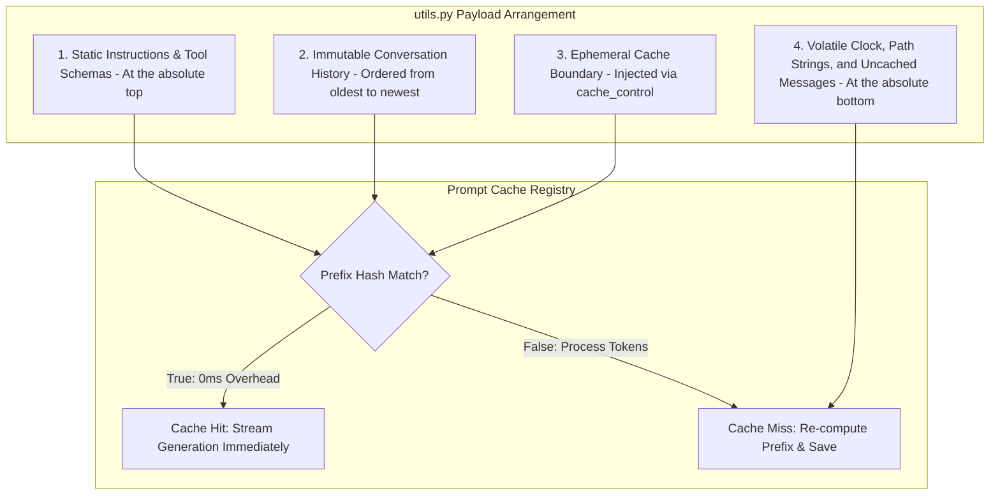

# Chapter 8: Prefix Prompt Cache Optimizer (utils.py Caching)

In **[Chapter 7: Semantic Context Compactor (CompactNode)](07_semantic_context_compactor_compactnode_.md)**, we implemented a semantic compression engine that prevents conversational histories from overflowing our model's token limits. However, even with pruned context tracks, sending 10,000+ tokens to an external API like Anthropic Claude or OpenAI on every state-machine loop introduces severe execution bottlenecks. 

In high-frequency autonomous agent loops, paying to transfer, parse, and process the same static tools schemas and historical buffers over and over is highly inefficient. We can solve this with the **Prefix Prompt Cache Optimizer** inside [`pocket_pi/workflow/utils.py`](../../pocket_pi/workflow/utils.py). 

By organizing our model inputs to exploit server-level prompt caching, we can reduce recurrent billing rates by up to 90% and decrease API latency from several seconds to milliseconds.

---

## 🏛️ The Architecture of Prefix Match Caching

In computer systems design, standard caches—such as CPU L2/L3 cash lines or **Translation Lookaside Buffers (TLBs)**—rely on spatial and temporal locality. Similarly, modern LLM providers offer server-side caching using a **Longest-Prefix Match (LPM)** algorithm, similar to how Layer 3 network routers look up IP routing tables.



If we change even a single character at the beginning of a payload—such as injecting a real-time timestamp or a changing workspace directory path—the entire prefix hash chain is broken. When this happens, the downstream parser triggers a complete **Cache Miss**, forcing the remote server to recompute and re-bill the entire token payload.

To guarantee high-probability cache hits, the `utils.py` executor applies two strict design rules:
1. **Symmetrical Prefix Ordering**: All static system prompts, base guidelines, and unchanging JSON-Schema tools are placed at the absolute top of the request block. Real-time environment parameters (like system times and changing context directories) are placed at the absolute bottom.
2. **Explicit Ephemeral Breakpoints**: For providers like Anthropic Claude, server caches are not automated. They require explicit `cache_control` headers injected at key points in the payload. If these are missing, the server bypasses the cache entirely.

---

## 🛠️ Step-by-Step Code Walkthrough

Let's look at how caching is implemented inside [`pocket_pi/workflow/utils.py`](../../pocket_pi/workflow/utils.py).

### Step 1: Defining the System-Prompt Cache Boundary

The first caching breakpoint is placed directly on our global system instructions. Since our core rules, system variables, and tool structures are static throughout the life of the session, we freeze this section first.

```python
system_block = [
    {
        "type": "text",
        "text": system_prompt,
        "cache_control": {"type": "ephemeral"}
    }
]
```
*Why this works*: Wrapping `system_prompt` in a structured content-block list with `"type": "ephemeral"` tells the API node to store our system prompt in its high-speed edge memory. During subsequent turns, this entire 2,000+ token block is resolved instantly with zero processing delay.

### Step 2: Isolating the Ephemeral Message Slices

In interactive developer loop workflows, our conversation stream grows incrementally. To cache this progressing history, we must identify and target the final user message.

```python
if anthropic_messages:
    last_msg = anthropic_messages[-1]
    raw_content = last_msg["content"]
```
*Why this works*: Identifying the final entry lets the engine inject our second cache control boundary at the current end of our conversation tree.

### Step 3: Handling Raw Conversational Strings Safely

If the active message contains a raw string, we convert it into an explicit content array configuration. This allows us to append our metadata flags without corrupting our database schema.

```python
if isinstance(raw_content, str):
    last_msg["content"] = [{
        "type": "text",
        "text": raw_content,
        "cache_control": {"type": "ephemeral"}
    }]
```
*Why this works*: Converting a flat string into an explicit structured array with `"type": "ephemeral"` makes our conversational history cache-ready. The server will cache all our historic messages up to this precise point.

### Step 4: Shallow Copy Injection for Tool Arrays

If our final message contains a multi-part tool-use structure or intermediate resource blocks, we perform a shallow copy to prevent state corruption. This prevents our caching parameters from leaking back into the persistent history managed by **[Chapter 4: Session Manager](04_tree_based_session_manager_sessionmanager_.md)**.

```python
elif isinstance(raw_content, list) and len(raw_content) > 0:
    new_content = [dict(b) for b in raw_content]
    new_content[-1]["cache_control"] = {"type": "ephemeral"}
    last_msg["content"] = new_content
```
*Why this works*: Cloning our array blocks in memory ensures that we apply `cache_control` to our active outgoing network payload without altering our local JSONL database logs on disk.

---

## 📈 Comparing Cache Operations: OpenAI vs. Anthropic

The table below explains how caching models differ across providers like OpenAI and Anthropic:

| Performance Metric | OpenAI (Automated Caching) | Anthropic (Explicit Breakpoints) |
| :--- | :--- | :--- |
| **Detection Method** | Server-side heuristics detect matching prefixes automatically. | Client-side payloads must explicitly mark nodes with `"cache_control"`. |
| **Minimum Prompt Size** | Minimum 1,024 prefix tokens required before caching begins. | Minimum 1,024 prefix tokens (Claude 3.5 Sonnet) / 2,048 tokens (Claude 3.5 Haiku). |
| **Optimized Billing Rates** | Automated ~50% discount on cache-hit prefix tokens. | Explicit ~90% cost reduction on cached input processing. |
| **Retention Window** | Typically preserved in server-side memory for 5 to 10 minutes. | Preserved in server-side memory for 5 minutes. |

By using our two-stage explicit caching architecture, Pocket-Pi supports both models. It provides hands-free automated optimization for OpenAI while ensuring reliable 90% cost savings on Anthropic's precise, manual cache-allocation pipelines.

---

## 🏆 Summary of the Pocket-Pi Architecture

Congratulations! You have completed the final chapter of the **Pocket-Pi Developer Tutorial**. Let's review the architectural components we've built:


By combining these architectural patterns, you can build production-ready, highly reliable developer loop agents:
1. **The Shared State** handles global variables.
2. **Workflow Nodes** isolate operations into clean pipelines.
3. **The State Machine Flow** structures reliable execution loops.
4. **The Session Manager Tree** prevents data loss during conversational rollbacks.
5. **The Fuzzy Match Editor** applies localized codebase modifications.
6. **The Security Gatekeeper** guards the host OS against unauthorized commands.
7. **The Context Compactor** prevents context window creep.
8. **The Cache Optimizer** reduces latency and cuts resource costs.

With these architectures in place, you are ready to design, deploy, and scale high-performance, cost-effective AI agents. Happy coding!

---
Generated with Pi Tutorial Builder.