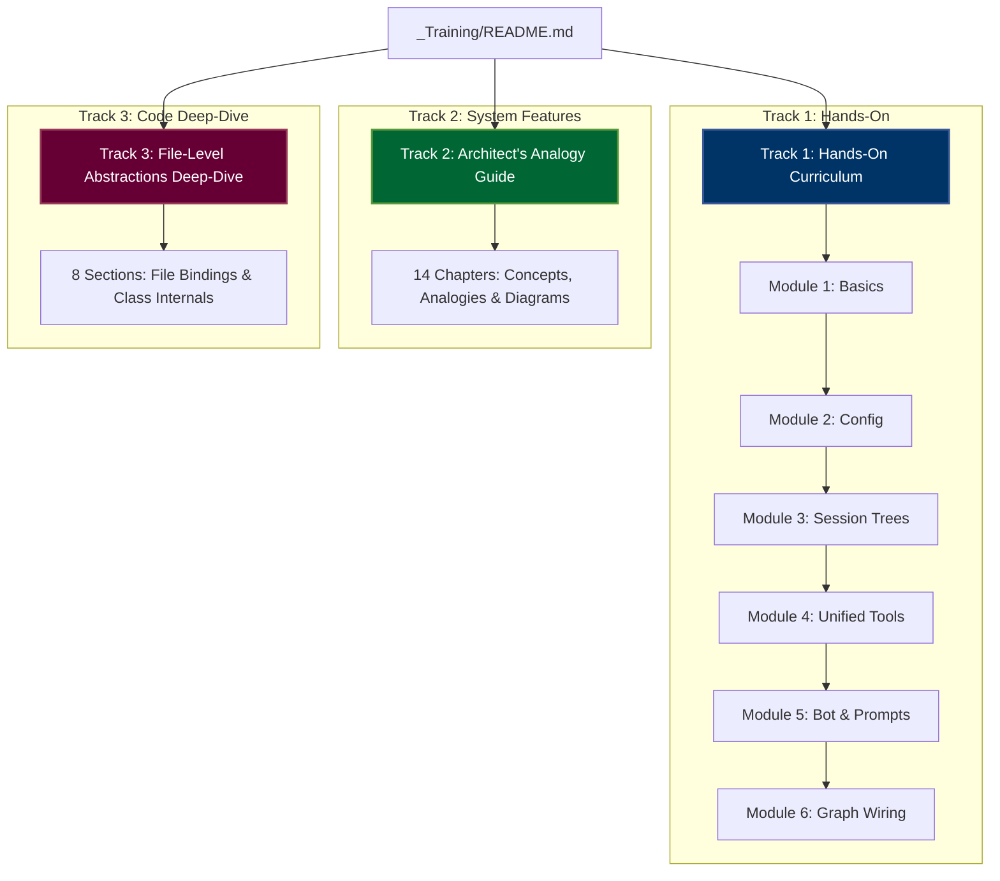
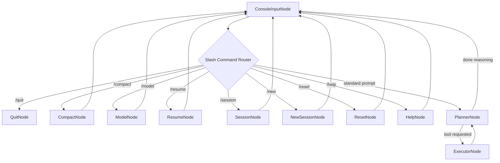

# 🎓 Pocket-Pi: Unified Learning & Training Portal

Welcome to the **Pocket-Pi Developer Learning & Training Portal**! This centralized directory compiles three independent, complementary learning tracks designed to onboard developers, software architects, and AI agents into the codebase and design paradigms of the Pocket-Pi coding agent harness.

Whether you want to build the state-machine from scratch, get a high-level visual analogy-driven overview of the features, or dive straight into low-level Python function and class definitions, choose your starting track below.

---

## 🗺️ The Three Learning Pathways

---

## 📚 Tracks Directory

### 🚀 Track 1: Hands-On Developer Curriculum (Modules 1-6)
*Recommended for: Developers who want to build, wire, and execute the agent from the ground up.*

A step-by-step developer tutorial tracing coding bounds, component scopes, and wiring constraints:
1. 📑 **[Module 1: PocketFlow Core Abstractions](01_pocketflow_basics.md)**
   - Understanding State-Machine Workflows.
   - Nodes (`prep`, `exec`, `post`), Flows, and central Shared State.
2. ⚙️ **[Module 2: Config & Project Trust Manager](02_configuration_manager.md)**
   - Hierarchical settings, JSON configurations, environment variable seeding.
   - Secure directory execution and `trust.json` boundaries.
3. 🌲 **[Module 3: Tree-based Session Manager](03_tree_session_manager.md)**
   - Moving from flat message arrays to conversational parent-child JSONL trees.
   - Dynamic context slicing, walking history to root, and context compaction.
4. 🛠️ **[Module 4: Unified File, Bash & Search Tools](04_unified_tool_suite.md)**
   - Slice-based file reading, safe bash limits, and Tavily REST searches.
   - Porting the resilient fuzzy-patching search-and-replace `edit` tool.
5. 🧠 **[Module 5: Workflow Nodes & Context Pruners](05_agent_nodes_orchestration.md)**
   - Interfacing with `prompt_toolkit` (completers, start-of-line lock).
   - Tool-pruners, prompt guidelines, and TUI presentation formatting with `rich`.
6. 🔗 **[Module 6: Graph Wiring & App Bootstrapping](06_wiring_and_running.md)**
   - Graph wiring loops (`ExecutorNode` cyclic routing to `PlannerNode` in `flow.py`).
   - Launching environment bootstrap scripts using `uv`.

---

### 🎨 Track 2: System Features & Analogy-Driven Architect's Guide
*Recommended for: System architects looking for high-level diagrams, execution sequences, and industry-standard analogues.*

An architectural guidebook presenting 14 functional areas, fully illustrated with visual **Mermaid sequence diagrams** and technical analogies (e.g. databases, compiler pipelines):
*   📘 **[Start Here: Track 2 Directory Portal](tutorial_agent_features/00_index.md)**
*   *Key Chapters:*
    - **Chapter 1**: `uv`-based Bootstrapping
    - **Chapter 2**: PocketFlow State-Machine Framework
    - **Chapter 3**: Shared State (Context Store)
    - **Chapter 5**: ConfigManager (Hierarchical Configuration)
    - **Chapter 6**: Tree-Based Session Manager (log branching)
    - **Chapter 11**: Fuzzy-Matching Line Editor (`edit` tool)
    - **Chapter 13**: Security Gatekeeper (permissions.json checkpointing)
    - **Chapter 14**: Project Trust Boundary

---

### 💻 Track 3: Code-Level Core Abstractions Deep-Dive
*Recommended for: Core maintainers and visiting AI agents wanting to inspect class properties, file mappings, and function signatures.*

A code-first analysis of pocket-pi's physical Python files and bindings, focused on logical roles and specific APIs:
*   📗 **[Start Here: Track 3 Directory Portal](Abstractions/00_index.md)**
*   *Key Sections:*
    - **Section 1**: Shared State (`shared.py`)
    - **Section 2**: Workflow Node (`node.py`)
    - **Section 3**: Workflows and Routing (`flow.py`)
    - **Section 4**: Log Tree databases (`session.py`)
    - **Section 5**: Resilient Modification Engine (`edit.py` algorithms)
    - **Section 6**: Permissions checking policies (`permissions_gate`)
    - **Section 8**: Prefix-based cached prompts and budget optimization

---

## 🏗️ Core Application State Graph

Regardless of the learning path you choose, all three pathways converge on this central cyclic state-machine loop that drives the Pocket-Pi agent shell:

---

*Get your favorite development environment ready, select your optimal starting track above, and dive in!* 🚀
