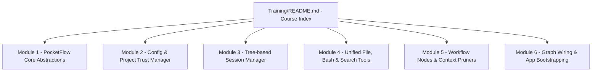
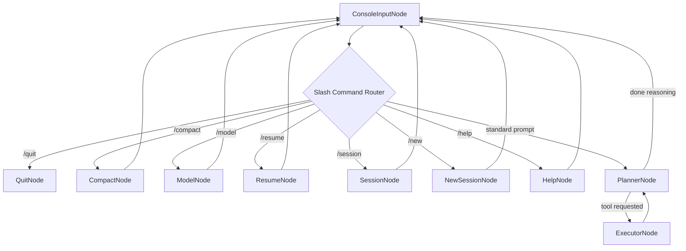

# 🎓 Pocket-Pi: Developer Training Course

Welcome to the **Pocket-Pi Developer Training Curriculum**! This course is designed specifically for software developers and data scientists who are familiar with Python, but are new to the [PocketFlow](https://github.com/The-Pocket/PocketFlow) state-machine workflow orchestration framework.

Through this series of deep-dive modules, you will learn how to build, maintain, and extend a complete,  a toy terminal coding assistant harness. We will trace every file, class, and logic boundary in **pocket-pi**—revealing how complex loops, structured LLM connectors, and filesystem operations are orchestrated beautifully using a declarative state-machine.

---

## 🗺️ Visual Course Syllabus / Directory Map

---

## 📚 Curriculum Index

Please follow the modules in numerical order for the best learning journey:

### 📑 [Module 1: PocketFlow Core Abstractions](01_pocketflow_basics.md)
*   What is PocketFlow? Understanding State-Machine Workflows.
*   The Three Pillar Abstractions: `Node`, `Flow`, and `Shared State`.
*   Writing Nodes (`prep`, `exec`, `post`).
*   Declaring graph routing and transitions using the `>>` and `-` operators.

### ⚙️ [Module 2: Config & Project Trust Manager](02_configuration_manager.md)
*   Hierarchical JSON Settings parsing (`settings.json` local vs. global).
*   Replicating the **Project Trust standard**: prompt prompts, writing `trust.json`.
*   Credential stores & automatic environment variable seeding (`os.environ`).
*   Configuring reasoning thinking levels and token budgets.
*   Writing silent background debug logs (`log_debug`).

### 🌲 [Module 3: Tree-based Session Manager](03_tree_session_manager.md)
*   The problem with flat session histories.
*   How pocket-pi stores conversations as a tree (`id`/`parentId` JSONL).
*   Walking the path: `get_path_to_root()` and chronology.
*   Integrating **Session Compaction**: Parsing `CompactionEntry` records, summary injections, and prunings.

### 🛠️ [Module 4: Unified File, Bash & Search Tools](04_unified_tool_suite.md)
*   Designing safe, robust tools for LLMs.
*   `read_file` offset-based line slicing, and `write_file`.
*   `execute_bash` with outputs limits, exit codes, and temp logs.
*   `web_search` using the Tavily Rest API.
*   **The Masterpiece**: Porting the original `pi` `edit` tool (fuzzy matching, char normalization, reverse substitutions, and carriage line preservation).

### 🧠 [Module 5: Workflow Nodes & Context Pruners](05_agent_nodes_orchestration.md)
*   Subclassing `pocketflow.Node`.
*   Interactive input loop using `prompt_toolkit` (completers, autocomplete start-of-line locks).
*   Implementing slash commands (`/new`, `/login`, `/resume`, `/model`, `/session`, `/compact`, `/help`, `/quit`).
*   **Prompt Engineering & Bias Defeat**: Dynamic contextual tool-pruners and non-contradictory prompts.
*   Beautiful TUI rendering: Soft-grey reasoning processes and bold green text boxes.

### 🔗 [Module 6: Graph Wiring & App Bootstrapping](06_wiring_and_running.md)
*   Declaratively writing the state machine in `flow.py`.
*   Cycle connections: Why `ExecutorNode` loops back to `PlannerNode`!
*   Initializing resources and launching the loop in `main.py`.
*   Running, syncing, and installing CLI packages using `uv`.

---

## 🏗️ Target Architecture Flowchart

During this course, we will trace and build this exact cyclic state-machine diagram:

---

## 📖 Self-Documenting Design & Progressive Disclosure

An advanced agentic architecture should understand itself. To support developers and visiting AI engines, Pocket-Pi ships with a structured **progressive disclosure documentation** framework located in the `/docs` directory. 

This model segments architectural knowledge sequentially to prevent cognitive overload:
- **Concept Discovery**: Users start at [`docs/index.md`](../docs/index.md) to locate core components.
- **Workflow Deep-Dives**: Detailed processes are discussed chronologically in specialized subtopics like [`docs/permissions.md`](../docs/permissions.md) and [`docs/skills.md`](../docs/skills.md).
- **Physical Schemas**: Low-level JSON structures, folder paths, and log behaviors are localized in files such as [`docs/logging.md`](../docs/logging.md).

Leveraging this structured self-documentation ensures any coding assistant working on Pocket-Pi can immediately retrieve precise system details and maintain context-aware consistency during extensions!

---

Get your favorite text editor ready, and let's jump into **[Module 1: PocketFlow Core Abstractions](01_pocketflow_basics.md)**! 🚀
