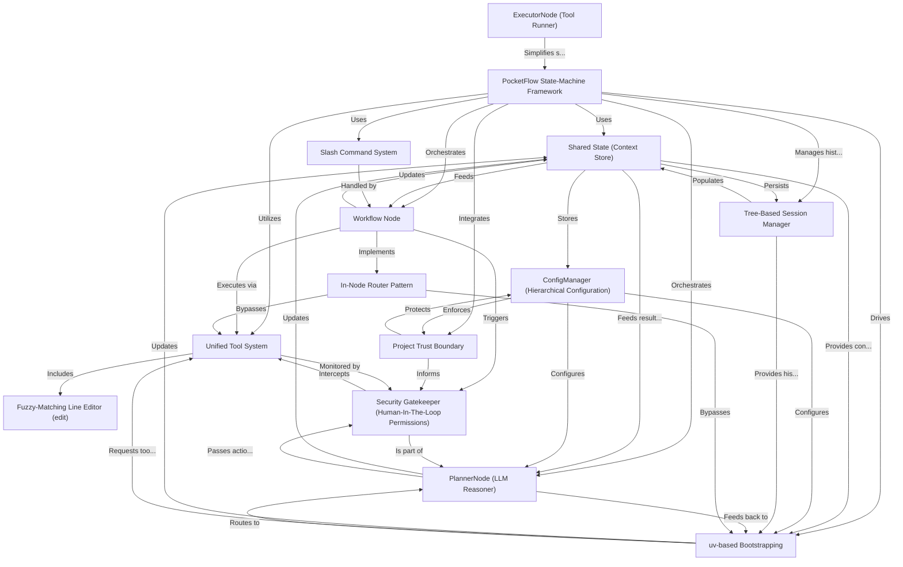

# Tutorial: Pocket_pi

> **Special Focus / Theme:** *The core features, designs, and architectures of the pocket-pi agent (hierarchical configurations, workspace trust boundary confirmation, log tree SessionManager, unified file/bash/search tool system, workflow state-machine nodes, and uv-based bootstrapping)*

Pocket-Pi is a **dynamic coding agent** implemented as an **educational refactor** of the original 'pi' agent, designed to make advanced agentic design and contextual workflows accessible to Python developers. Its core functionality revolves around a **state-machine architecture** managed by **PocketFlow**, which orchestrates tasks as a network of independent **Workflow Nodes**. All communication between these nodes happens through a **Shared State (Context Store)**, ensuring consistent and up-to-date information. Key features include a **Tree-Based Session Manager** for robust, branching conversation history (similar to Git), a **Unified Tool System** for interacting safely with the file system and executing bash commands, and a **Fuzzy-Matching Line Editor** for precise code modifications. **ConfigManager** handles hierarchical settings and **Project Trust Boundary** ensures security, prompting user permission for untrusted configurations. **uv-based Bootstrapping** simplifies setup and deployment, while the **In-Node Router Pattern** and **Security Gatekeeper (Human-In-The-Loop Permissions)** optimize performance and safety by intercepting and sometimes fast-tracking or requiring approval for potentially risky actions.

**Source Repository:** https://github.com/mbenetti/Pocket-Pi.git

<h2>Chapters</h2>

1. [uv-based Bootstrapping](01_uv_based_bootstrapping.md)
2. [PocketFlow State-Machine Framework](02_pocketflow_state_machine_framework.md)
3. [Shared State (Context Store)](03_shared_state_context_store_.md)
4. [Workflow Node](04_workflow_node.md)
5. [ConfigManager (Hierarchical Configuration)](05_configmanager_hierarchical_configuration_.md)
6. [Tree-Based Session Manager](06_tree_based_session_manager.md)
7. [Slash Command System](07_slash_command_system.md)
8. [PlannerNode (LLM Reasoner)](08_plannernode_llm_reasoner_.md)
9. [ExecutorNode (Tool Runner)](09_executornode_tool_runner_.md)
10. [Unified Tool System](10_unified_tool_system.md)
11. [Fuzzy-Matching Line Editor (edit)](11_fuzzy_matching_line_editor_edit_.md)
12. [In-Node Router Pattern](12_in_node_router_pattern.md)
13. [Security Gatekeeper (Human-In-The-Loop Permissions)](13_security_gatekeeper_human_in_the_loop_permissions_.md)
14. [Project Trust Boundary](14_project_trust_boundary.md)

---
Generated by Pi Tutorial Builder Extension : https://github.com/mbenetti/pi-tutorial-builder.git