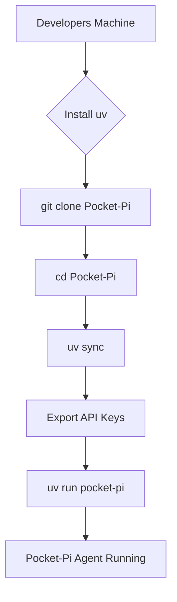

# Chapter 1: uv-based Bootstrapping

Welcome to the foundational chapter of your Pocket-Pi journey! This section introduces you to the streamlined process of getting Pocket-Pi up and running, leveraging the powerful `uv` package manager. Think of `uv` as your project's specialized pit crew, efficiently handling all the crucial setup tasks so you can focus on working with the agent.

## The Need for Efficient Bootstrapping

Before diving into the intricate state-machine architecture or the intelligent workflows of Pocket-Pi, the very first step is always setting up your development environment. In traditional Python projects, this often involves:
1. Cloning the repository.
2. Creating a virtual environment.
3. Installing dependencies with `pip`.
4. Configuring environment variables.
5. Manually executing the main script.

While manageable, this sequence can be prone to errors, version conflicts, or inconsistencies across different developer machines. For an agentic system like Pocket-Pi, which strives for simplicity and immediate utility, a robust and intuitive bootstrapping mechanism is paramount.

Just as a modern operating system needs a reliable bootloader to initialize hardware and load the kernel, Pocket-Pi requires an efficient system to prepare its execution environment. This is where `uv` shines.

## What is `uv`? A Pit Crew for Your Project

`uv` is a next-generation Python package installer and resolver, built for speed and reliability. But for Pocket-Pi, `uv` acts as more than just a package installer; it’s a **bootstrapper**: a unified control plane for getting the entire project from source code to a running application in just a few commands.

Consider `uv` analogous to a sophisticated **Continuous Integration/Continuous Deployment (CI/CD) pipeline** but tailored for your local development environment. It automates common setup tasks, ensuring that Pocket-Pi's dependencies are correctly installed, and the application is invoked with the right context.

## The `uv`-based Bootstrapping Flow

The `uv`-based bootstrapping process for Pocket-Pi can be visualized as a simple yet powerful pipeline:



Let's break down each step:

### 1. Cloning the Repository

```bash
git clone https://github.com/mbenetti/Pocket-Pi.git
cd Pocket-Pi
```
This initial step is standard for any open-source project. You retrieve the Pocket-Pi source code from its GitHub repository, bringing the entire codebase, including its `.git` history, to your local machine.

### 2. Synchronizing Dependencies with `uv sync`

```bash
uv sync
```
This is where `uv` performs its primary magic. Similar to how `npm install` handles Node.js dependencies, or `go mod download` manages Go modules, `uv sync` reads Pocket-Pi's `pyproject.toml` file. It then:
*   **Resolves dependencies:** Determines the exact versions of all required packages to prevent conflicts.
*   **Creates a virtual environment (if needed):** Isolates Pocket-Pi's dependencies from your system-wide Python installation, maintaining a clean workspace. This is akin to a containerization system like Docker creating an isolated environment for an application module.
*   **Installs packages:** Downloads and installs all necessary Python libraries with incredible speed, leveraging its Rust-based architecture.

This command ensures that all the external tool libraries, UI rendering engines (`rich`), and internal `PocketFlow` state-machine framework modules are correctly placed and ready for use. It's like provisioning all the necessary hardware components on a server rack before deploying an application.

### 3. Configuring API Keys

```bash
export ANTHROPIC_API_KEY="sk-ant-..."
# or
export OPENAI_API_KEY="sk-proj-..."
```
Pocket-Pi relies on Large Language Models (LLMs) from providers like Anthropic or OpenAI. This step involves setting corresponding API keys as environment variables. These keys act as authentication tokens, granting Pocket-Pi access to the powerful LLM services. Without these, the agent's core reasoning capabilities, driven by the `PlannerNode` (as you'll explore in Chapter 8), cannot function. This is parallel to configuring access credentials for a cloud service or a database.

### 4. Running Pocket-Pi with `uv run`

```bash
uv run pocket-pi
```
This is the final, pivotal step. `uv run` executes the Pocket-Pi agent. Thanks to the `[project.scripts]` section in the `pyproject.toml` (which declares `pocket-pi = "pocket_pi.main:main"`), `uv` knows exactly how to invoke the main entry point of the application.

```toml
[project.scripts]
pocket-pi = "pocket_pi.main:main"

[tool.uv]
package = true
```

The `uv run pocket-pi` command does several things:
*   **Activates the virtual environment:** Ensures the agent runs with its precisely installed dependencies.
*   **Locates the entry point:** Finds the `main()` function within `pocket_pi/main.py`.
*   **Executes the application:** Starts the Pocket-Pi interactive terminal interface.

This unified command abstracts away the complexities of virtual environment activation and script invocation, much like a well-configured `Makefile` target or a `docker-compose up` command simplifies orchestrating multi-service applications. The `main.py` entry point handles further bootstrapping within the application itself, initializing the `ConfigManager` for hierarchical configurations (Chapter 5), the `SessionManager` for session logging (Chapter 6), and establishing the workspace trust boundary (Chapter 14).

### Bootstrapping Beyond `uv run`: Global Installation

For convenience, you can also install Pocket-Pi globally within your `uv` environment:

```bash
uv tool install .
# Or, using pip-style editable install
pip install -e .
```
After this, you can simply run `pocket-pi` from any directory, turning it into a system-wide command that utilizes the `uv`-managed installation. This is analogous to installing a CLI utility globally via a package manager like `brew` or `apt`.

## Summary: The Power of `uv`-based Bootstrapping

`uv`-based bootstrapping for Pocket-Pi streamlines the setup process by providing a fast, reliable, and unified interface. It simplifies:
*   **Dependency Management:** `uv sync` ensures all required packages are correctly installed, mitigating "dependency hell."
*   **Environment Isolation:** Automatic creation of virtual environments prevents conflicts.
*   **Application Launch:** `uv run` provides a straightforward way to execute the agent's main script.
*   **Simplified Global Use:** Tools like `uv tool install` allow for easy global access.

This approach not only simplifies the initial setup but also maintains a consistent and reproducible development environment, crucial for understanding and extending Pocket-Pi's sophisticated features, such as its `PocketFlow` state-machine framework, which we'll explore next.

This robust bootstrapping lays the groundwork for the core features of Pocket-Pi, enabling you to quickly interact with its hierarchical configurations, ensure workspace trust boundaries, and leverage its unified tool system right from the start.

In the next chapter, we'll delve into the very heart of Pocket-Pi's operational logic: the `PocketFlow` State-Machine Framework, understanding how it orchestrates the agent's complex behaviors.

---
Generated with Pi Tutorial Builder.