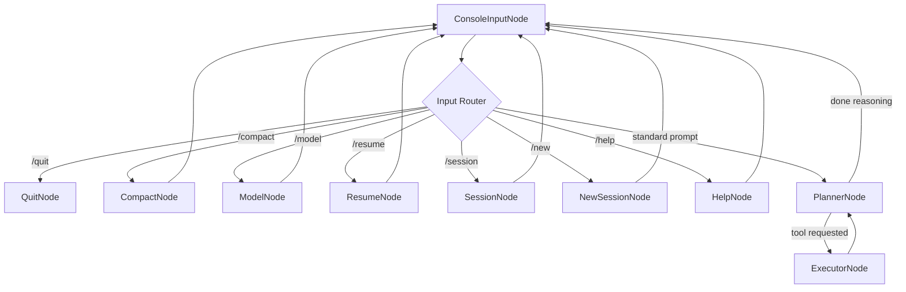

# Chapter 2: PocketFlow State-Machine Framework

Having explored the foundational `uv`-based bootstrapping and installation in Chapter 1, we now turn our attention to the operational core of `Pocket-Pi`: the `PocketFlow` state-machine framework. Just as a modern CPU orchestrates its instruction pipeline, `PocketFlow` acts as the grand orchestrator for `Pocket-Pi`'s agentic logic, ensuring tasks are executed efficiently, in the correct order, and with robust error handling.

## The Agent's Nervous System: Why State Machines?

Imagine a complex manufacturing plant. Materials don't simply flow down a linear conveyor belt; they move between specialized workstations, pause, wait for quality checks, get rerouted, or even loop back for rework. An agent's workflow is similarly non-linear and adaptive. If represented as a traditional linear script, the logic quickly devolves into a labyrinth of `if/else` statements, deeply nested function calls, and implicit state management, leading to:

1.  **Complexity and Brittleness**: Modifications cascade unpredictably, making the system difficult to reason about and prone to bugs.
2.  **Lack of Transparency**: Tracing the agent's decision-making and execution path becomes a debugging nightmare.
3.  **Limited Reusability**: Components are tightly coupled, hindering independent testing and redeployment.
4.  **Inefficient Looping**: Agentic loops (e.g., plan, execute tool, observe, replan) are hardcoded and rigid, rather than dynamically managed.

`PocketFlow` addresses these challenges by modeling the entire agent's logic as a **finite state machine (FSM)**. This approach mirrors battle-tested systems like those found in operating system schedulers, network packet routing, or modern workflow orchestrators such as [Apache Airflow](https://airflow.apache.org/) and [Temporal.io](https://temporal.io/). Each distinct action or decision point in the agent's lifecycle is a "state" (Node), and the progression between these actions is an "event" (Flow).

## PocketFlow's Architectural Pillars: Nodes, Flows, and Shared State

`PocketFlow` simplifies the complexity of FSMs into three core, interlocking abstractions:

1.  **Nodes (The Workstations)**: Independent units of work, akin to microservices or specialized processing units in a compiler pipeline. Each `Node` encapsulates a specific task, such as reading console input, calling an LLM, or executing a shell command.
2.  **Flows (The Routing Logic)**: The director. A `Flow` defines the tracks and switches that connect `Nodes`, dictating the permissible transitions between them based on dynamic conditions (action strings).
3.  **Shared State (The Conveyor Belt)**: A central, mutable data structure (a dictionary) that carries all relevant information as it travels between `Nodes`. This acts as the single source of truth, enabling `Nodes` to communicate without direct coupling.

### 1. Nodes: The Agent's Atomic Operations

A `Node` is where the actual computational work happens. Following the principle of "separation of concerns," `PocketFlow` `Nodes` divide their execution into three distinct phases: `prep`, `exec`, and `post`. This structured approach is fundamental for building robust, testable, and maintainable agent logic, similar to how a well-designed API separates request parsing, business logic execution, and response formatting.

Consider a `ConsoleInputNode` that handles user interaction:

```python
from pocketflow import Node
from rich.console import Console

class ConsoleInputNode(Node):
    def prep(self, shared: dict) -> Console:
        # Prepare context for execution (e.g., instantiate Rich Console)
        return shared.get("console", Console())

    def exec(self, console: Console) -> str:
        # Execute the core logic: get user input
        return console.input("[bold green]> [/bold green]")

    def post(self, shared: dict, prep_res: Console, exec_res: str) -> str:
        # Update shared state and determine next action
        shared["user_input"] = exec_res.strip()
        if shared["user_input"].startswith("/"):
            command = shared["user_input"].split(" ")[0]
            if command == "/quit":
                return "quit"
            # ... other slash commands ...
        return "default"
```
*Explanation*:
*   The `prep` method extracts or initializes necessary resources from the `shared` dictionary. Here, it gets the `rich.Console` object for terminal interaction.
*   The `exec` method performs the primary, isolated computation—in this case, prompting the user for input. It operates solely on the output of `prep`, ensuring no direct `shared` state modification.
*   The `post` method integrates the `exec` result back into the `shared` state (`shared["user_input"]`) and critically determines the *next action* as a string. This action string is the "policy header" that the `Flow` uses for routing. If the input is `/quit`, it returns `"quit"`; otherwise, it returns `"default"`.

This three-phase structure isolates concerns: `prep` for input/context gathering, `exec` for pure computation, and `post` for output/state update and **routing decision**.

### 2. Flows: The Agent's Railroad Switchyard

A `Flow` is the blueprint of `Pocket-Pi`'s state machine. It declares how `Nodes` are interconnected and under which conditions execution transitions from one `Node` to another. Think of it as the routing table in a network switch or the state transition matrix in an FSM library like [XState](https://xstate.js.org/).

In `Pocket-Pi`, the main flow is defined in `pocket_pi/workflow/flow.py` within the `PiAgentFlow` class.

```python
from pocketflow import Flow
# ... import various Nodes ...

class PiAgentFlow(Flow):
    def __init__(self):
        # 1. Instantiate all required nodes
        console_input = ConsoleInputNode()
        planner_node = PlannerNode()
        executor_node = ExecutorNode()
        quit_node = QuitNode()
        # ... other nodes for /help, /model, etc. ...

        # 2. Define the routing (wiring the graph)
        # Default connection: executes if 'post' returns "default"
        console_input >> planner_node
        
        # Conditional connections: executes if 'post' returns specific action strings
        console_input - "quit" >> quit_node
        
        # Agentic loop for tool execution
        planner_node - "tools" >> executor_node
        executor_node >> planner_node # CRUCIAL: Executor loops back to Planner!
        planner_node - "done_reasoning" >> console_input # LLM done, wait for next user input
        
        # 3. Designate the starting node
        super().__init__(start=console_input)
```
*Explanation*:
*   **Node Instantiation**: All `Nodes` are created. These are independent "stations" ready to receive a "state packet."
*   **Default Connections (`>>`)**: The `>>` operator defines a default transition. If `console_input.post()` returns `"default"`, the `Flow` automatically routes to `planner_node`.
*   **Conditional Connections (`- "action" >>`)**: The `- "action" >>` operator defines a conditional transition. If `console_input.post()` returns `"quit"`, execution moves to `quit_node`. This allows for diverse branching based on distinct outcomes.
*   **Agentic Feedback Loop**: Notice the critical `planner_node - "tools" >> executor_node` followed by `executor_node >> planner_node`. This forms a tight, autonomous feedback loop. When the `PlannerNode` decides to use a tool, it routes to `ExecutorNode`. After the tool runs, rather than returning control to the user, `ExecutorNode` loops *back* to `PlannerNode`. This allows the LLM to observe the tool's result, potentially execute more tools, and then only return to `console_input` when it has "done reasoning" and formed a complete response. This pattern is vital for stable LLM agentic behavior, preventing premature user interaction and enabling self-correction.
*   **Starting Node**: `super().__init__(start=console_input)` designates the entry point of the `Flow`. The `PocketFlow` runtime will begin execution from this `Node`.

Here's a visual representation of `Pocket-Pi`'s core state machine in `flow.py`, analogous to a complex rail yard:



*Explanation*: This diagram illustrates how `ConsoleInputNode` acts as the initial hub. Based on user input (slash commands vs. standard prompts), it routes to various administrative `Nodes` (like `CompactNode`, `HelpNode`) or the core `PlannerNode`. Crucially, after administrative tasks, control always returns to `ConsoleInputNode`. For complex agentic tasks, the core `PlannerNode` and `ExecutorNode` form a tightly coupled, self-correcting feedback loop before returning control to the user through `ConsoleInputNode`.

### 3. Shared State: The Agent's Global Memory Bus

The `shared` state is a standard Python dictionary (`dict`) that acts as the single source of truth for the entire `PocketFlow` execution. It's passed by reference (in-place) between all `Nodes`. This mechanism is akin to a shared memory segment in an operating system or a global context object in a web application framework.

```python
# In main.py, before flow.run()
shared_state = {
    "config": config_manager_instance, # From Chapter 5
    "session": session_manager_instance, # From Chapter 6
    "exit": False,
    "user_input": "",
    "llm_response": "",
    # ... any other data relevant to the agent's current task ...
}

# Then, flow.run(shared_state)
```
*Explanation*:
*   `main.py` initializes this `shared_state` dictionary with essential components like `config` (for hierarchical configurations, Chapter 5), `session` (for managing the conversation history tree, Chapter 6), and control flags like `exit`.
*   As execution progresses, `Nodes` read from and write to this dictionary. For example, `ConsoleInputNode.post()` updates `shared["user_input"]`, and `PlannerNode.post()` might update `shared["llm_response"]`.
*   This central `shared` state streamlines data transfer, eliminates the need for complex parameter passing between `Nodes`, and makes the agent's current context transparent and auditable.

## Running the Flow: The Event Loop

The `flow.run(shared)` command initiates the `PocketFlow` engine. It's an event loop that continuously executes the current `Node` and transitions to the next based on the `post()` method's return value. The loop continues until a `Node` returns an action for which no successor is defined, or until a specific exit condition (like `shared["exit"] = True`) is met. This robust execution model ensures `Pocket-Pi` remains responsive and capable of handling complex, long-running agentic interactions.

## The Power of Declarative Design

The `PocketFlow` state-machine framework liberates `Pocket-Pi` from the constraints of imperative, linear scripting. By defining the agent's logic declaratively as a network of `Nodes` and `Flows` interacting via a `Shared State`, we gain:

*   **Modularity**: Each `Node` is a self-contained unit, simplifying development and testing.
*   **Visibility**: The `Flow` diagram provides a clear, visual representation of the agent's behavior, making it easy to understand and debug.
*   **Robustness**: Explicit state transitions and isolated `Nodes` reduce the surface area for bugs and improve error recovery.
*   **Flexibility**: The agent's behavior can be easily modified by rewiring `Flows` or introducing new `Nodes` without affecting the core logic.

This architecture ensures that `Pocket-Pi` isn't just a collection of scripts, but a truly dynamic and adaptive agent capable of navigating intricate tasks.

Next, we delve deeper into the `Shared State` itself, exploring how `Pocket-Pi` leverages a central `Context Store` to ensure consistent data availability and efficient communication across all `Nodes` in **Chapter 3: Shared State (Context Store)**.

---
Generated with Pi Tutorial Builder.