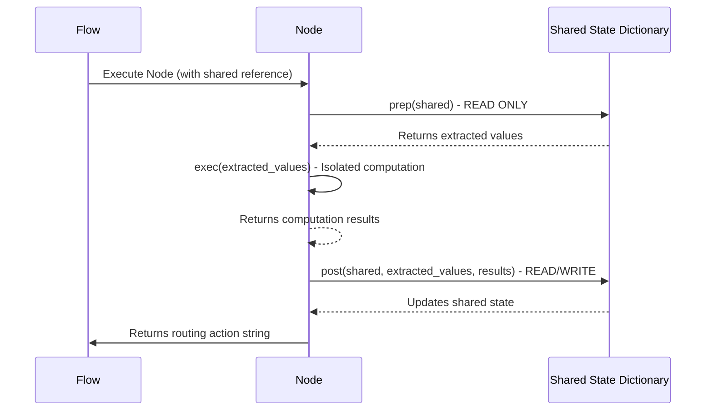

# Chapter 3: Shared State (Context Store)

Following our exploration of the **PocketFlow State-Machine Framework** in Chapter 2, we now turn to its foundational component: the **Shared State**, also known within Pocket-Pi as the **Context Store**. While Chapter 2 introduced the `Node` and `Flow` as the processing units and orchestrator, it's the Shared State that provides the central nervous system, enabling these disparate components to communicate and coordinate their efforts.

Just as a motherboard's bus serves as the high-speed data highway connecting CPU, RAM, and peripherals, the Shared State is a central Python dictionary through which all parts of the Pocket-Pi agent communicate. Every `Node` reads information from this 'shared' dictionary to get its instructions and writes its results back into it for other nodes to consume. This single source of truth ensures that, even though different parts of the agent work independently, they all operate with the same, up-to-date information, maintaining a consistent global view of the agent's current task and environment.

## The Global Control Panel: Anatomy of the Shared State

The Shared State in Pocket-Pi is not merely a transient data carrier; it's a carefully structured registry designed to hold all critical runtime information, system configurations, and dynamic session data. It's akin to the global process environment variables and shared memory segments in an operating system, providing a stable, universally accessible context for all running tasks.

Here's a breakdown of some core components typically found within Pocket-Pi's Shared State, offering a glimpse into its architecture:

```mermaid
graph TD
    A[Shared State (Python Dictionary)] --> B[config: Hierarchical Configuration]
    A --> C[session: Tree-Based Session Manager]
    A --> D[exit: Boolean Flag]
    A --> E[workspace_trust_confirmed: Boolean Flag]
    A --> F[agent_trajectory: List of Actions]
    A --> G[last_tool_output: Dictionary]
    A --> H[user_input: String]
```

Let's examine some of these key entries:

*   **`config`**: This holds the agent's hierarchical configuration, managed by the `ConfigManager`. It allows nodes to access settings like LLM API keys, tool paths, or logging levels.
*   **`session`**: Managed by the `SessionManager`, this entry tracks the agent's current working directory, open files, active projects, and even a tree-like representation of its interaction history.
*   **`exit`**: A boolean flag (`False` by default) that, when set to `True` by any node, signals the `Flow` orchestrator to gracefully terminate the agent's execution loop.
*   **`workspace_trust_confirmed`**: Critical for security, this flag indicates whether the user has confirmed trust for the current project's workspace, enabling potentially risky operations like shell commands.
*   **`agent_trajectory`**: A history of key actions and decisions made by the agent, useful for debugging, auditing, and replay, much like an event log in a distributed transaction system.
*   **`last_tool_output`**: Stores the results of the most recently executed tool, making it immediately available for the next `Node` (e.g., a `PlannerNode`) to process.
*   **`user_input`**: Holds the latest command or query received from the user.

## Bootstrapping and Lifetime

The Shared State is instantiated once at the very beginning of the Pocket-Pi application's lifecycle, typically within `pocket_pi/main.py`. This initialization phase sets up the core system boundaries and injects essential services, much like an operating system's kernel initialization before user-space processes are launched.

```python
# Initializing core system components
config = ConfigManager("pocket_pi_config.toml")
session = SessionManager(project_root="/path/to/project")

# Constructing the Shared State dictionary
shared = {
    "config": config,
    "session": session,
    "exit": False,
    "workspace_trust_confirmed": False,
    "user_input": None,
    "agent_trajectory": [],
    # ... other core entries
}

# The state machine Flow receives this dictionary reference
agent_flow = PiAgentFlow()
agent_flow.run(shared)
```
In this snippet, `shared` is populated with instances of core managers (`ConfigManager`, `SessionManager`) and initial flags. This exact dictionary reference is then passed to the `PiAgentFlow.run()` method. From this point forward, every `Node` within the `Flow` operates on this singular, mutable instance of `shared`, acting as a global database for the agent's entire operation.

## The Three-Phase Interaction Pattern

As introduced in Chapter 2, `PocketFlow` nodes adhere to a strict three-phase execution model: `prep()`, `exec()`, and `post()`. This pattern is crucial for managing the Shared State and preventing unintended side-effects, akin to how database transactions enforce ACID properties to maintain data integrity.



1.  **`prep(shared)`**: This method is designed for **read-only** extraction. It receives the `shared` dictionary and is responsible for pulling out only the specific pieces of information (e.g., `shared["user_input"]`, `shared["config"].llm_model`) required for the node's computation. It *must not* modify the `shared` dictionary. This isolation simplifies testing and ensures that the `exec` phase operates on a stable snapshot of its inputs.

    ```python
    def prep(self, shared):
        # Extract user input and current API key from config
        user_input = shared.get("user_input")
        api_key = shared["config"].get("llm_api_key")
        return {"prompt": user_input, "api_key": api_key}
    ```
    This method returns a small dictionary or tuple containing only the data necessary for the `exec` phase, decoupling the computation from the full Shared State.

2.  **`exec(prep_results)`**: This is the heart of the node's computation. Crucially, it receives only the `prep_results` as arguments and has **no direct access** to the `shared` dictionary. This enforces strong isolation, ensuring that computationally intensive, potentially long-running, or I/O-bound operations (like making an LLM API call, running a shell command, or reading a file) cannot inadvertently modify the Shared State mid-execution. This design is analogous to immutable data structures within functional programming or sandboxed processes in operating systems, promoting reliability and testability.

    ```python
    def exec(self, prep_results):
        prompt = prep_results["prompt"]
        key = prep_results["api_key"]
        # Simulate an LLM call
        response = f"LLM responded to '{prompt}' using key {key[:5]}..."
        return response
    ```
    The `exec` method processes its inputs and returns its computed results, which are then passed to the `post` method.

3.  **`post(shared, prep_results, exec_results)`**: The `post` method is the only phase authorized to **modify** the `shared` dictionary. Here, the results of `exec` are committed back to the Shared State, and the node makes any necessary updates (e.g., `shared["last_response"] = exec_results`, `shared["agent_trajectory"].append(...)`). This centralized 'write-back' point simplifies state management and makes it easy to trace how the Shared State evolves over the agent's lifetime. Finally, `post` **must** return an action string (e.g., `"default"`, `"success"`, `"error"`) to dictate the flow's next transition.

    ```python
    def post(self, shared, prep_results, exec_results):
        # Update shared state with the LLM's response
        shared["llm_output"] = exec_results
        shared["agent_trajectory"].append({
            "action": "llm_query",
            "input": prep_results["prompt"],
            "output": exec_results
        })
        # Signal a successful transition
        return "default"
    ```

## Pitfalls and Best Practices

While simple, the Shared State's power comes with responsibility. Disregarding its strict interaction rules can lead to hard-to-debug issues, akin to direct memory manipulation in systems programming without proper locks or access controls.

1.  **Never Reassign `shared`**: Within a node, performing `shared = {}` or `shared = new_dict` will break the reference to the global `shared` dictionary. Nodes must always modify the dictionary **in-place** (e.g., `shared["my_key"] = value`, `shared.update(...)`).
2.  **`post()` Must Return a String**: The `post()` method's return value is *not* the `shared` dictionary. It is a string key that PocketFlow uses to determine the next `Node` in the `Flow`. Returning the `shared` dictionary itself will cause a `TypeError` due to how the successor router hashes transition keys.
3.  **Laziness vs. Pre-calculation**: While `prep` encourages extracting only what's needed, for complex, hierarchical data structures within `shared` (like the `ConfigManager` or `SessionManager`), it's often more efficient to pass the manager objects themselves to `exec` rather than extracting dozens of individual settings. The isolation rule primarily targets external I/O or heavy computation.

The Shared State, especially with its structured components like the `SessionManager` (for historical context and file system interaction) and `ConfigManager` (for managing hierarchical settings and feature flags), becomes the central data fabric of Pocket-Pi. It's the persistent memory and configuration register that allows the agent to maintain context, react intelligently, and orchestrate its complex goals.

Now that we thoroughly understand how the Shared State acts as the central data bus for Pocket-Pi, we can delve into its specific components and how they leverage this shared context to provide intelligent, contextual agency. Our next chapter will focus on the **`ConfigManager (Hierarchical Configuration)`**, detailing how settings and environment variables are structured and made accessible throughout the agent's lifecycle.

---

## 🔗 Next Lesson

*   **Next Chapter:** [Chapter 4: Workflow Node](04_workflow_node.md)

---
Generated with Pi Tutorial Builder.