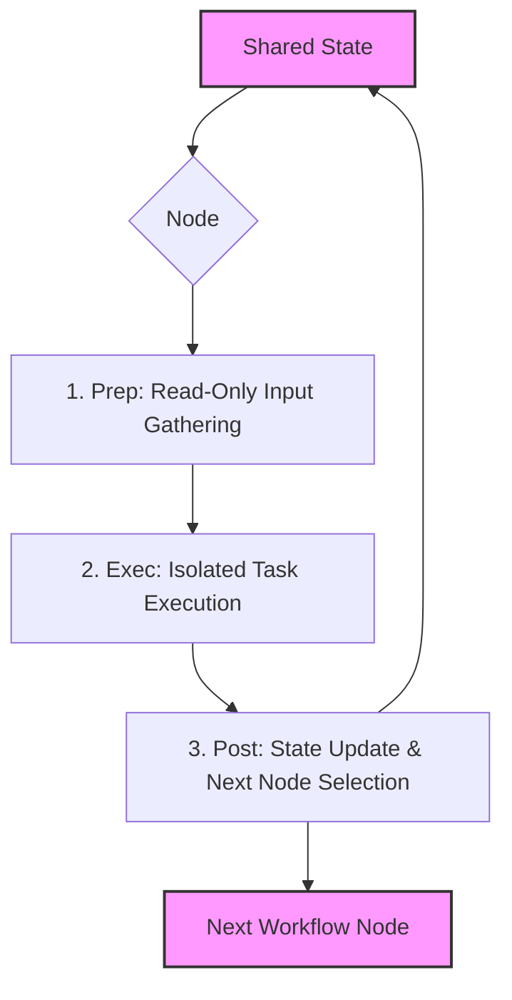

# Chapter 4: Workflow Node

In [Chapter 3: Shared State (Context Store)](03_shared_state_context_store_.md), we established the `Shared State` as the universal information bus—the read/write memory component of our `PocketFlow` state machine. Now, let's turn our attention to the active processors that interact with this shared memory: the **Workflow Node**.

A `Workflow Node` represents a single, independent, and atomic step within Pocket-Pi's state machine. Think of it as a specialized worker at an automated assembly plant, or a discrete task in a distributed workflow system like **Apache Airflow** or **Temporal**. Each Node has a very specific, limited job, and it performs this job without interfering with other workers or components, adhering to a strict, well-defined process. This structured approach is fundamental to building robust, testable, and maintainable agentic systems.

## The Node's Mandate: Isolation, Determinism, and Testability

The core design philosophy behind a `Workflow Node` is to ensure **isolation**, **determinism**, and **testability**. In complex agentic systems like Pocket-Pi, where LLMs can generate unpredictable outputs and external tools introduce side effects, controlling the flow of information and execution is paramount.

Each `Node` in Pocket-Pi operates under a strict three-phase process:
1.  **Prep Phase (Read-Only):** Gathers necessary information from the `Shared State`.
2.  **Exec Phase (Isolated Action):** Performs its specific task using only the information from `prep`.
3.  **Post Phase (State Update & Routing):** Updates the `Shared State` with its results and determines the next `Node` in the workflow.

This lifecycle enforces a clear separation of concerns, preventing accidental state corruption and making each step predictable.



## The Three-Phase Execution Lifecycle

All `Workflow Nodes` in Pocket-Pi inherit from `pocketflow.Node` and must implement its three lifecycle methods. Let’s examine each phase through the lens of a factory worker processing an item on an assembly line.

### 1. The `prep(self, shared)` Phase: Gathering Information

The `prep` method is the first to execute. Its role is to act as a **read-only interface** to the `Shared State`. It collects all the necessary data from the `shared` dictionary that the `exec` phase will need to perform its task. It then bundles this data into a return value.

Crucially, `prep` **must not** modify the `shared` dictionary. Any modification here would be a side effect, breaking the isolation principle.

```python
# From pocket_pi/workflow/nodes.py (ConsoleInputNode)
class ConsoleInputNode(Node):
    def prep(self, shared):
        # In ConsoleInputNode, prep doesn't need external data
        # but for other nodes, it extracts what's needed.
        # Example from a simplified PlannerNode:
        # return shared["session"].build_session_context()
        return None # For ConsoleInputNode, nothing complex is needed from shared
```
In this `ConsoleInputNode` example, `prep` simply returns `None` because its `exec` phase (reading user input) doesn't initially depend on complex data from `shared`. However, for a `PlannerNode`, `prep` would carefully curate the conversation history, configuration, and tools from `shared` to prepare the LLM call. This is akin to a worker meticulously gathering all architectural blueprints and raw materials from storage before beginning construction.

### 2. The `exec(self, prep_result)` Phase: Performing the Work

The `exec` method receives the output of the `prep` phase as its sole input. This is where the `Node` performs its actual, isolated work. This might involve:
-   Calling an external API (e.g., an LLM in `PlannerNode`).
-   Running a shell command (e.g., in `ExecutorNode`, abstracted by `run_tool`).
-   Performing a CPU-bound computation (e.g., parsing text, data transformation).
-   Interacting with the user (e.g., reading input in `ConsoleInputNode`).

The `exec` phase **must not** access or modify the `shared` dictionary directly. It only operates on the data passed to it and returns its result. This strict isolation makes the `exec` method highly testable; it's a pure function or a controlled side-effect unit, similar to a stateless microservice endpoint.

```python
# From pocket_pi/workflow/nodes.py (ConsoleInputNode)
    def exec(self, info_str): # info_str is the result from prep()
        try:
            # Use prompt_toolkit only if standard input is an active terminal (TTY)
            if sys.stdin.isatty():
                user_input = self.session.prompt("pocket-pi > ").strip()
            else:
                prompt_text = Text("pocket-pi > ", style="bold rgb(0,255,100)")
                console.print(prompt_text, end="")
                user_input = sys.stdin.readline().strip()
            return user_input
        except (KeyboardInterrupt, EOFError):
            return "/quit"
```
Here, `ConsoleInputNode.exec` uses `prompt_toolkit` to display a user prompt and capture input. It doesn't touch `shared`, only processing the information passed to it (which in this case was `None` from `prep`, but is used by `prompt_toolkit` to render the prompt). The output `user_input` is then passed to the `post` phase. This is the worker performing their specific, hands-on task at their workstation, using only the materials provided, and producing a finished component.

### 3. The `post(self, shared, prep_result, exec_result)` Phase: Updating State and Routing

The `post` method is the final stage. It receives three arguments: the mutable `shared` dictionary, the result from `prep`, and the result from `exec`. Its responsibilities are:
-   To **update the `shared` dictionary** with the results of the `exec` phase, making them available for subsequent nodes.
-   To **return an "action string"** that dictates the next `Node` in the workflow. This acts as a signal for the `PocketFlow` orchestrator.

> ⚠️  **Critical Rule:** The `post` method **MUST** return a string (e.g., `"default"`, `"tools"`, `"loop"`). It must **NEVER** return the `shared` dictionary itself, as this would break the `PocketFlow` routing mechanism and lead to errors like `TypeError: unhashable type: 'dict'`.

```python
# From pocket_pi/workflow/nodes.py (ConsoleInputNode)
    def post(self, shared, prep_res, user_input):
        shared["user_input"] = user_input # Update shared state with input
        
        if not user_input:
            return "input_again" # Return a routing action
            
        # ... logic for handling slash commands or direct bash execution ...
        # (covered in next section)
        
        shared["session"].append_message(role="user", content=user_input)
        return "default" # The standard routing action
```
In `ConsoleInputNode.post`, the `user_input` obtained during `exec` is now written back into `shared["user_input"]`. Additionally, if the input is a normal conversational message, it's appended to the session history via `shared["session"].append_message`. Finally, it returns `"default"`, signaling to the `PocketFlow` orchestrator that the next step should be the default successor `Node`. This is like the worker placing the finished component on the conveyor belt and attaching a tag that says "goes to Quality Control next," ready for the scheduler to route it.

## Case Study: In-Node Router Pattern for Speed

One of Pocket-Pi's powerful features is its ability to directly execute shell commands like `!ls -la` immediately from the input prompt. As described in [_Training/05_agent_nodes_orchestration.md](_Training/05_agent_nodes_orchestration.md), a naive approach might involve creating a dedicated `DirectBashNode` and routing to it. However, this incurs latency for fast, local operations due to state transmission overhead.

Pocket-Pi employs an **In-Node Router Pattern** directly within the `post` phase of `ConsoleInputNode` to handle these scenarios with sub-millisecond execution:

```python
# From pocket_pi/workflow/nodes.py (ConsoleInputNode.post)
        # Direct local bash execution (starts with "!" or "!!")
        if user_input.startswith("!"):
            # ... (extract command and print output) ...
            
            # Execute bash safely using our robust tool dispatcher
            output = run_tool("bash", {"command": command}, cwd=str(shared["session"].cwd))
            
            # Print output block nicely
            console.print(Panel(output, title="Process Output", border_style="cyan"))
            
            # Log directly in the session tree as a "bashExecution" role message
            shared["session"].append_message(
                role="bashExecution",
                content=bash_msg_obj
            )
            return "input_again" # Loop immediately!
```
By performing the `run_tool("bash", ...)` call and updating the `shared["session"]` directly within the `ConsoleInputNode.post` method, Pocket-Pi achieves:
-   **Minimal Latency:** The execution occurs immediately, avoiding any state machine transition overhead. This is crucial for interactive terminal experiences, much like a network router can quickly forward packets directly from an ingress port to an egress port using built-in routing tables, rather than passing them up to a higher-level network stack.
-   **State Consistency:** Despite bypassing the main LLM planning loop, the session log (`shared["session"]`) is still updated with the command and its output, preserving a complete audit trail.
-   **Simplified Orchestration:** The `return "input_again"` action immediately routes back to the `ConsoleInputNode`, eliminating unnecessary `Node` instantiations and context transfers.

This pattern demonstrates how `Workflow Nodes` can embed complex logic and make intelligent routing decisions at their final `post` phase, optimizing for performance and specific interaction models, while still adhering to the core `PocketFlow` principles.

## Transitioning to the Next Phase

With a solid understanding of how individual `Workflow Nodes` function as isolated, deterministic processing units, the next logical step is to see how these individual components are connected and orchestrated.

Proceed to [Chapter 5: ConfigManager (Hierarchical Configuration)](05_configmanager_hierarchical_configuration_.md) to learn how configuration settings are managed and made accessible to these Workflow Nodes, influencing their behavior and the overall agent's operation.

---

## 🔗 Next Lesson

*   **Next Chapter:** [Chapter 5: ConfigManager (Hierarchical Configuration)](05_configmanager_hierarchical_configuration_.md)

---
Generated with Pi Tutorial Builder.