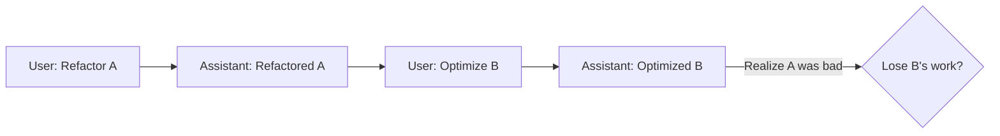
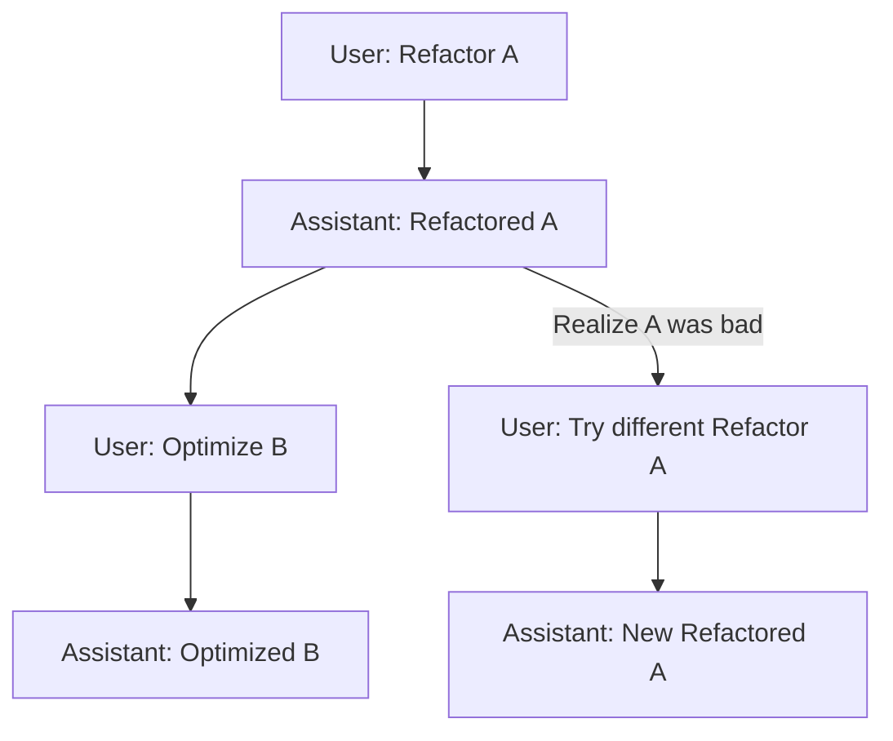

# Chapter 6: Tree-Based Session Manager

In Chapter 3, "Shared State (Context Store)", we explored how a central, mutable dictionary serves as the common data bus for all of Pocket-Pi's operations. This `shared` state holds crucial runtime information, including instances of core managers. Among these, the `SessionManager` is paramount. While the `PocketFlow` framework (Chapter 2) orchestrates the agent's actions and the `ConfigManager` (Chapter 5) provides hierarchical configurations, the `SessionManager` provides the critical long-term memory, enabling version control-like capabilities for your entire interaction history with Pocket-Pi.

Traditional conversational agents often treat chat history as a flat, linear sequence of messages. This approach, similar to a simple log file, works adequately for short, uninterrupted dialogues. However, for complex problem-solving scenarios, especially in a coding agent, a linear history is a significant liability. If an agent explores a flawed path or you wish to experiment with a different instruction to resolve a problem, reverting to an earlier point in the conversation typically means discarding all subsequent messages. This is akin to losing unsaved work or having to manually `git reset --hard` and re-derive changes, leading to lost effort and reduced productivity.

The `Tree-Based Session Manager` in Pocket-Pi directly addresses this by adopting an architecture inspired by version control systems like Git. Instead of a linear log, your interactions are stored as a Directed Acyclic Graph (DAG), specifically a tree structure. This allows you to explore multiple solutions, backtrack effortlessly, and preserve every divergent path you take during a session.

## The Problem with Flat History: Why We Need a Tree

Consider a scenario where you're asking Pocket-Pi to refactor a piece of code.

**Linear History Analogy:**
You ask: "Refactor function A."
Pocket-Pi replies: (Refactored code)
You ask: "Now, optimize function B."
Pocket-Pi replies: (Optimized code)
You then realize the refactoring of function A had an unintended side effect. To try a different approach for function A, in a linear system, you'd have to discard the optimization of function B, effectively losing that work.



**Tree-Based History Solution:**
With a tree structure, you can "branch off" from an earlier point.


In this tree, the discussion leading to "Optimized B" remains preserved on its own branch. You can freely switch to the new "New Refactored A" branch and continue from there, or even later return to the "Optimized B" branch if you decide against the alternative refactoring. This flexibility is fundamental for iterative problem-solving and complex agentic workflows.

## Anatomy of a Session: JSONL and the Persistence Layer

Pocket-Pi's sessions are persisted to disk using a standard, line-delimited JSON format, commonly known as **JSONL**. Each line in the session file is a self-contained JSON object representing an "entry" in the conversation tree. This design is highly robust and fault-tolerant, similar to how transactional databases use Write-Ahead Logs (WAL) or append-only file systems. If Pocket-Pi crashes, the session file isn't corrupted; new entries are simply appended atomistically.

Session files are stored in a structured directory based on the project's current working directory (CWD), ensuring isolation between different projects:

```python
# From pocket_pi/session.py
self.cwd = Path(cwd).resolve()
self.session_dir = Path("~/.pocket_pi/agent/sessions").expanduser()
# Replace '/' with '-' for unique session directories per project
cwd_dir_name = "--" + str(self.cwd).replace("/", "-").replace("\\", "-").strip("-") + "--"
self.project_session_dir = self.session_dir / cwd_dir_name
```
This ensures that `Pocket-Pi` maintains distinct session histories for different code repositories or working directories, analogous to how separate Git repositories manage their `.git` folders independently.

Each entry in the JSONL file contains:
*   `id`: A unique identifier for the entry.
*   `parentId`: The `id` of the entry from which this one branches.
*   `type`: The type of entry (e.g., `message`, `compaction`, `session_info`, `model_change`).
*   `timestamp`: When the entry was created.
*   `message`/`summary`/`name`: The actual payload of the entry.

Appending an entry is a simple, highly efficient operation:

```python
# From pocket_pi/session.py
def _write_entry(self, entry: Dict[str, Any]):
    entry_id = entry["id"]
    self.entries[entry_id] = entry
    self.entries_ordered.append(entry_id) # For chronological ordering during loading
    
    if self.session_file:
        self.session_file.parent.mkdir(parents=True, exist_ok=True)
        with open(self.session_file, "a", encoding="utf-8") as f:
            f.write(json.dumps(entry) + "\n")
```
This append-only mechanism ensures data integrity, making the `SessionManager` resilient to unexpected interruptions.

## Traversing the Tree: Reconstructing History for LLMs

While the session is stored as a tree, Large Language Models (LLMs) still consume a linear sequence of messages. The `SessionManager`'s crucial task is to reconstruct this linear "path to root" from the currently active leaf node. This process is akin to `git log --oneline --follow <file>` which traces the lineage of a file through its commit history.

```mermaid
graph TD
    Leaf[Current Leaf Node] --> B[Parent Node]
    B --> C[Grandparent Node]
    C --> D[Great-Grandparent Node]
    D -- ... --> Root[Root Node]
    
    subgraph Path Reconstruction
        direction LR
        P1[Leaf] --- P2[Parent] --- P3[Grandparent] --- P4[Root]
    end
    
    note right of Path Reconstruction: Reverse order for LLM context (Root to Leaf)
```

The `get_path_to_root` method handles this traversal:

```python
# From pocket_pi/session.py
def get_path_to_root(self, leaf_id: Optional[str] = None) -> List[Dict[str, Any]]:
    curr_id = leaf_id or self.current_leaf_id
    path = []
    visited = set()
    
    while curr_id:
        if curr_id in visited:
            break  # Prevent cycle crashes (robustness against corrupted data)
        visited.add(curr_id)
        
        entry = self.entries.get(curr_id)
        if not entry:
            break
            
        path.append(entry)
        curr_id = entry.get("parentId")
        
    # Since we walked backwards, reverse list to restore chronology (oldest to newest)
    path.reverse()
    return path
```
This method starts at the specified `leaf_id` (or `self.current_leaf_id` if not provided) and iteratively follows the `parentId` links until it reaches an entry with no parent (`parentId` is `None`) or encounters a previously visited node (a safety guard against corrupted cyclic references). The `visited` set acts as a cycle detector, similar to how graph traversal algorithms prevent infinite loops. Finally, the collected path is reversed to present a chronological order from the oldest message to the newest, as expected by LLMs.

## Context Compaction: Managing the LLM's Short-Term Memory

LLMs have finite context windows. Long conversations quickly exceed these limits, leading to increased costs and degraded performance. The `SessionManager` incorporates a "context compaction" mechanism to address this, inspired by data archival strategies where old, granular data is summarized.

When a session becomes too long, Pocket-Pi can introduce a `CompactionEntry`. This special entry contains an LLM-generated summary of the older parts of the conversation up to a certain point (`firstKeptEntryId`). When `build_session_context` is called, it:
1.  Identifies the most recent `CompactionEntry` on the active path.
2.  Injects its summary as a system message at the beginning of the context.
3.  Effectively "prunes" all messages preceding the `firstKeptEntryId`, replacing them with the summary.

```python
# From pocket_pi/session.py
def build_session_context(self, leaf_id: Optional[str] = None) -> List[Dict[str, Any]]:
    path = self.get_path_to_root(leaf_id)
    compaction_entry = None
    for entry in reversed(path): # Find latest compaction
        if entry.get("type") == "compaction":
            compaction_entry = entry
            break
            
    context_messages = []
    if compaction_entry:
        # Inject formatted summary
        context_messages.append({
            "role": "system",
            "content": f"[COMPACTED SESSION CONTEXT SUMMARY]\nThis is a brief summary...\n\"{compaction_entry['summary']}\"\n[END COMPACTED SUMMARY]"
        })
        # Only keep entries from firstKeptEntryId onwards
        keep = False
        for entry in path:
            if entry["id"] == compaction_entry["firstKeptEntryId"]:
                keep = True
            if keep and entry["id"] != compaction_entry["id"]:
                msg = self._serialize_entry_to_chat(entry)
                if msg: context_messages.append(msg)
    else: # No compaction, append all messages
        for entry in path:
            msg = self._serialize_entry_to_chat(entry)
            if msg: context_messages.append(msg)
            
    return context_messages
```
This mechanism dynamically manages the LLM's context window, optimizing token usage without losing the essence of the earlier conversation. It's similar to how a database might perform data aggregation or roll-up operations to reduce historical detail for long-term storage while preserving high-level trends.

## Bridging Internal State to External APIs: `_serialize_entry_to_chat`

Another critical function of the `SessionManager` is to translate Pocket-Pi's internal JSONL entry format into the standardized `ChatCompletion` message format expected by LLM providers like OpenAI and Anthropic. This abstraction layer ensures that the internal representation can evolve without breaking compatibility with external APIs.

The `_serialize_entry_to_chat` method handles this translation, paying special attention to how tool calls and their results are represented. This is crucial for the `PlannerNode` (Chapter 8) and `ExecutorNode` (Chapter 9) to effectively utilize and interpret tool outputs.

```python
# From pocket_pi/session.py
def _serialize_entry_to_chat(self, entry: Dict[str, Any]) -> Optional[Dict[str, Any]]:
    if entry.get("type") != "message": return None
    msg_obj = entry.get("message", {})
    role = msg_obj.get("role")
    content = msg_obj.get("content")

    if role in ("user", "system"):
        # Format simple text content
        return {"role": role, "content": text_content}
    elif role == "assistant":
        # Supports both text and structured tool calls
        res = {"role": "assistant", "content": text_content}
        if tool_calls: res["tool_calls"] = tool_calls
        return res
    elif role == "toolResult":
        # Specifically formats tool outputs, linking to tool_call_id
        return {
            "role": "tool",
            "tool_call_id": msg_obj.get("toolCallId") or "unknown_id",
            "content": text_content
        }
    # ... handles other specific message types like bashExecution ...
    return None
```
This intricate mapping ensures that the LLM receives messages in the precise schema it expects, allowing it to correctly understand previous tool executions, user queries, and system instructions, which is vital for maintaining the agent's coherent thought process.

## Branching and Navigation: The User's Interaction Points

The power of the tree-based session manager is exposed to the user through various slash commands (Chapter 7), allowing seamless navigation:

*   `/new`: Starts a completely fresh conversation branch, effectively creating a new leaf node from the session root or an explicit parent.
*   `/resume`: Allows the user to select an existing session from a list, loading its `current_leaf_id` and making it active.
*   `branch_to(entry_id)`: A programmatic function that updates `self.current_leaf_id` to a specified `entry_id`. This effectively "checks out" a different point in the conversation tree, discarding any unreferenced sub-branches until they are explicitly navigated back to. This is analogous to `git checkout <commit-hash>` in a version control system.

```python
# From pocket_pi/session.py
def branch_to(self, entry_id: str):
    """
    Moves current leaf position to any earlier entry in the tree structure.
    """
    if entry_id not in self.entries:
        raise ValueError(f"Entry {entry_id} does not exist in the session database.")
    self.current_leaf_id = entry_id
```

This simple yet powerful mechanism, tied into the interactive interface, provides an unprecedented level of control and flexibility for debugging and exploring solutions with the agent.

## Conclusion

The `Tree-Based Session Manager` is a cornerstone of Pocket-Pi's agentic architecture, providing version control-like persistence for conversational context. By moving beyond linear chat histories, it empowers users to explore multiple solution paths, backtrack gracefully, and manage complex interactions over extended periods without data loss. Its fault-tolerant JSONL storage, intelligent path traversal, dynamic context compaction, and robust API serialization are all designed to enable a sophisticated, resilient, and highly productive agentic experience.

This robust session management system lays the groundwork for Pocket-Pi's intelligent decision-making and execution. Next, we will explore how Pocket-Pi processes and responds to user commands and system actions through the **Slash Command System** in Chapter 7, completing more of the agent's interactive user experience.

---
Generated with Pi Tutorial Builder.