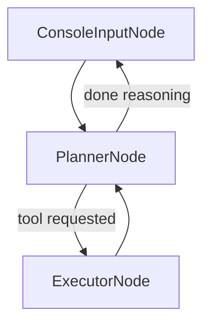

# Chapter 8: PlannerNode (LLM Reasoner)

In the preceding chapters, we’ve established a robust foundation for Pocket-Pi: the efficient `uv`-based bootstrapping (Chapter 1), the orchestrating `PocketFlow` state-machine framework (Chapter 2), the unifying Shared State as its central nervous system (Chapter 3), the modular `Workflow Nodes` as its atomic operations (Chapter 4), and the `ConfigManager` managing its hierarchical settings and security boundaries (Chapter 5), and the `SessionManager` providing historical context (Chapter 6). Now, building upon these pillars, we arrive at the intellectual core of Pocket-Pi: the **`PlannerNode`**.

The `PlannerNode` is the brain of the Pocket-Pi agent—the Large Language Model (LLM) Reasoner that processes your requests, interprets the current context, and decides on the optimal next steps. Like a skilled chess grandmaster, it plans its moves, determines if it needs to use any external "tools" (such as reading a file, executing a shell command, or searching the web), and then formulates a response or a comprehensive plan of action.

Crucially, the `PlannerNode` is designed with sophisticated logic to prevent common LLM "hallucinations" or inefficient behaviors, particularly the notorious "tool-calling bias." It dynamically adjusts its behavior and system prompt based on whether tools are genuinely needed, avoiding unnecessary and costly tool invocations.

## The `PlannerNode`'s Role in the `PocketFlow`

Recall from Chapter 2 (`PocketFlow` State-Machine Framework) that the `PlannerNode` occupies a pivotal position in the agent's core loop. After receiving user input from the `ConsoleInputNode`, the `PlannerNode` is the primary recipient for deliberation. Its output then directs the flow, either returning a direct textual response to the user or routing to the `ExecutorNode` if tools are required, initiating the crucial agentic feedback loop.

Here's a condensed look at its position in the `PocketFlow` diagram:



This diagram illustrates a critical mechanism: the `ExecutorNode` always loops back to the `PlannerNode`. This allows the LLM to observe the results of its tool calls (e.g., the output of a `bash` command or a `read` operation), process that information, and then decide its *next* action – whether to call more tools, or finally, to formulate a cohesive response and return control to the user. This "observation-action-re-plan" loop is fundamental to robust agentic behavior, much like a control system continuously sampling sensors, computing an action, and re-evaluating its state.

## Three Phases of Intelligent Planning

Like all `Workflow Nodes` in Pocket-Pi, the `PlannerNode` adheres to the strict `prep()`, `exec()`, and `post()` lifecycle to maintain state integrity and modularity.

### 1. The `prep(self, shared)` Phase: Contextual Intelligence Gathering

The `prep` phase for the `PlannerNode` is where crucial contextual information is gathered and meticulously prepared for the LLM. This is analogous to a CPU preparing its instruction cache and registers before executing a complex operation.

```python
# From pocket_pi/workflow/nodes.py (PlannerNode.prep)
    def prep(self, shared):
        log_debug("[PlannerNode] Rebuilding session context history...")
        messages = shared["session"].build_session_context() # 1. Build context
                
        user_msg = "" # 2. Determine if model needs tools
        # ... logic to extract latest user message ...
                
        use_tools = True
        # ... logic to inspect user_msg for coding/search/path markers ...
            
        tools_list = TOOLS_SCHEMA if use_tools else [] # Decide on tools
        
        # 3. Setup System instructions based on tool availability
        current_date = time.strftime("%Y-%m-%d")
        cwd_str = str(shared["session"].cwd)
        
        if use_tools:
            system_prompt = f"""Current Working Directory: {cwd_str} ... Available tools: - read, - write, - edit, - bash ..."""
        else:
            system_prompt = f"Current Working Directory: {cwd_str} ... You are pocket-pi ... a helpful and friendly assistant. Answer ... concisely using direct conversational text."
        
        session_id = shared["session"].get_session_name()
        
        return {
            "config": shared["config"],
            "messages": messages,
            "system_prompt": system_prompt,
            "tools": tools_list,
            "session_id": session_id
        }
```
Let's break down the `prep` method's key responsibilities:

1.  **Building Session Context**: `shared["session"].build_session_context()` is invoked. As explored in Chapter 6 (Tree-Based Session Manager), this method reconstructs the conversation history, intelligently applying compaction to manage token limits and ensuring the LLM receives the most relevant and highest-fidelity context. This is akin to a database query optimizer constructing an efficient query plan based on available indexes and statistical information.
2.  **Dynamic Tool Pruning**: This is paramount for LLM efficiency.
    *   The latest user message is extracted from the `messages` history.
    *   This message is then analyzed for "coding indicators" (like "read," "write," "bash," "python," "file," "/", "."), "search indicators" ("search," "web," "news," "google"), or "path markers" (containing "/" or ".").
    *   If *no* such indicators are found, the `PlannerNode` makes an intelligent decision: `use_tools` is set to `False`. This prevents the LLM from receiving a list of tools for simple conversational queries (e.g., "Hi there!"), thereby eliminating the "tool-calling bias" where LLMs feel compelled to use tools even when inappropriate. This is a form of intelligent load balancing or traffic shaping, where resources (LLM token budget, API calls) are only allocated when actually needed.
3.  **Dynamic System Prompt Swapping**: This mechanism directly addresses the "Instruction Contradiction" problem discussed in `_Training/05_agent_nodes_orchestration.md`. If `use_tools` is `False`, the system uses a simpler, conversational prompt. If `use_tools` is `True`, it provides a detailed "coding prompt" outlining the available tools and their usage. This ensures the LLM's instructions are always consistent with the tools it actually has, avoiding situations where it receives instructions about tools it doesn't have, leading to confused or empty responses. This is similar to a microservices architecture where service stubs are dynamically swapped based on the service mesh's capabilities.

This meticulously prepared context, including the dynamically pruned tool list and system prompt, is then passed to the `exec` phase.

### 2. The `exec(self, data)` Phase: LLM Query and Interactive Status

The `exec` method is where the `PlannerNode` makes its primary LLM API call. However, even this "simple" call is enhanced with user experience and interruption capabilities.

```python
# From pocket_pi/workflow/nodes.py (PlannerNode.exec)
    def exec(self, data):
        provider = data["config"].provider
        model = data["config"].model
        budget = data["config"].thinking_budget
        level = data["config"].thinking_level
        log_debug(f"[PlannerNode] Querying LLM Provider: {provider}/{model}...")
        
        import threading, queue
        res_queue = queue.Queue()
        def run_query(): # Function to run LLM call in a separate thread
            try:
                response = call_llm(...) # Actual LLM call encapsulated in call_llm
                res_queue.put(("success", response))
            except Exception as e:
                res_queue.put(("error", str(e)))
                
        t = threading.Thread(target=run_query, daemon=True)
        t.start()
        
        # Non-blocking interactive spinner with Ctrl+C/Escape detection
        # ... (tty setup, console.status, select.select, termios) ...
        try:
            with console.status(f"[dim italic]pocket-pi is thinking ({provider}/{model})...[/dim italic]", spinner="pocket"):
                while t.is_alive():
                    # ... check for keyboard inputs ...
                    time.sleep(0.05)
        finally:
            # ALWAYS restore terminal settings
            # ... (termios.tcsetattr) ...
                
        # Retrieve results
        status, res = res_queue.get_nowait()
        if status == "success": return res
        else: return {"error": res}
```
Key elements of the `exec` phase:

1.  **Asynchronous LLM Call with Spinner**: The actual LLM API call (via `call_llm`) is executed in a separate thread. While the LLM is processing, a custom `rich` spinner (`"pocket"`) is displayed in the terminal. This provides critical visual feedback to the user, indicating that the agent is "thinking" instead of appearing unresponsive. This user experience enhancement is akin to how modern web applications display loader animations during asynchronous data fetches.
2.  **Interruptible Execution (Ctrl+C/Escape)**: A highly specialized piece of code sets the terminal into "raw" mode (`tty.setcbreak(fd)`) and actively monitors for `Ctrl+C` or `Escape` key presses *without* requiring the user to press Enter. This allows the user to interrupt long-running LLM calls, providing a responsive and flexible user experience. This advanced input handling is reminiscent of how debuggers or system monitors capture low-level keyboard events.
3.  **Error Handling**: If the LLM API call fails (e.g., network error, invalid API key, rate limit), the error is captured and returned, preventing the agent from crashing and ensuring a graceful recovery path.

The `exec` method thus encapsulates the intelligence of querying the LLM while maintaining an interactive and robust terminal experience.

### 3. The `post(self, shared, prep_res, result)` Phase: Response Handling and Routing

The `post` method is where the `PlannerNode` evaluates the LLM's response, updates the `Shared State`, provides visual feedback, and makes its crucial routing decision for the `PocketFlow`.

```python
# From pocket_pi/workflow/nodes.py (PlannerNode.post)
    def post(self, shared, prep_res, result):
        if "error" in result:
            # ... cleanup orphaned user message ...
            console.print(Panel("[bold red]⚠️ Connection Failed:[/bold red] ...", ... ))
            log_debug(f"[PlannerNode] Connection failure: {result['error']}...")
            return "loop" # Return to console input on error

        if result.get("thinking"):
            console.print(Panel(Text(result["thinking"].strip(), style="rgb(90,90,90) italic"), title="💭 Thinking Process", ...))
            
        if result.get("text"):
            console.print(Panel(Markdown(result["text"].strip()), title="🤖 Response", ...))
            
        shared["last_response"] = result["text"]
        shared["last_thinking"] = result["thinking"]
        shared["last_tool_calls"] = result["tool_calls"] # Key update for ExecutorNode
        
        content_blocks = [] # Build content for session log
        if result.get("text"): content_blocks.append({"type": "text", "text": result["text"]})
        for tc in result.get("tool_calls", []):
            content_blocks.append({"type": "toolCall", "id": tc["id"], "name": tc["name"], "arguments": tc["arguments"]})
            
        shared["session"].append_message(role="assistant", content=content_blocks, thinking=result["thinking"])
        
        if result.get("tool_calls"):
            log_debug(f"[PlannerNode] Routing to Executor with {len(result['tool_calls'])} tool call(s)...")
            return "tools" # Route to ExecutorNode
        log_debug("[PlannerNode] Reasoning finished. Routing back to user input.")
        return "loop" # Route back to ConsoleInputNode
```
Here's what unfolds in the `post` phase:

1.  **Error Handling and User Feedback**: If an error occurred in `exec` (e.g., API connection failure), the failed user message is "orphaned" (removed) from the `SessionManager`'s history to avoid polluting the context. A prominent error panel is displayed to the user, and the flow reroutes immediately back to the `ConsoleInputNode` (`"loop"` action) to allow the user to retry or correct the issue. This is crucial for maintaining system stability and user trust, similar to how an exception handling block in a compiler catches errors and provides feedback to the developer.
2.  **Displaying LLM Thoughts and Responses**: If the LLM generates `thinking` output (its internal monologue or reasoning process) or `text` (its direct response), these are rendered in distinct `rich` panels. The `thinking` panel uses muted gray colors to visually differentiate it from the more prominent `Response` panel, maintaining a clean and legible terminal UI. This aesthetic choice aligns with principles of progressive disclosure, allowing the user to dive into the thought process if desired without it being overwhelming.
3.  **Updating Shared State**: The LLM's `text` response, `thinking` output, and crucially, any `tool_calls` generated by the LLM are stored in the `shared` dictionary (`shared["last_response"]`, `shared["last_thinking"]`, `shared["last_tool_calls"]`). This makes these results immediately available for the next `Node` in the `PocketFlow`.
4.  **Session Logging**: The LLM's full assistant message, including its text and any tool calls, is appended to the session trace managed by the `SessionManager`. This ensures a complete, auditable history of the agent's actions and thought processes is persisted. This commitment to state is analogous to a distributed transaction system committing its event log.
5.  **Dynamic Routing Decision**: Finally, the `PlannerNode` makes its core routing decision:
    *   If the LLM has generated any `tool_calls`, the `PlannerNode` returns the action string `"tools"`. This directs the `PocketFlow` to route to the `ExecutorNode` (Chapter 9) to run these tools.
    *   If no `tool_calls` were generated (meaning the LLM has completed its reasoning and provided a final text-based response), the `PlannerNode` returns the action string `"loop"`. This routes the `PocketFlow` back to the `ConsoleInputNode`, prompting the user for their next input.

This dynamic routing is the essence of cooperative agentic behavior, allowing the `PlannerNode` to intelligently delegate tasks to specialized `ExecutorNodes` or engage in direct conversation as appropriate.

## The Power of Intelligent Orchestration

The `PlannerNode` is not merely an LLM wrapper; it's a sophisticated orchestrator that leverages Pocket-Pi's foundational components to create an intelligent, robust, and user-friendly agent. Its ability to dynamically prune tools, swap system prompts, provide interactive feedback, and make intelligent routing decisions demonstrates a deep understanding of agentic system design principles. It ensures that the LLM is always operating with the correct context, efficiently, and without falling into common pitfalls, transforming a raw LLM into a powerful reasoning engine.

## Exercises for Students

1.  **Add a "Self-Correction" Keyword**: Currently, `PlannerNode.prep` detects `coding_keywords` and `search_keywords` to decide if tools are needed. Add a new category of `reflection_keywords` (e.g., "re-evaluate", "check my work", "debug this") that, if detected, *always* forces `use_tools = True`, regardless of other markers. Explain the reasoning for this.
2.  **Persistent System Prompt**: The system prompt is currently built on the fly. Propose a modification where parts of the system prompt (e.g., the "Current Working Directory" and "Available tools" sections) could be loaded from external Markdown files found in `.pocket_pi/prompts/` to allow users to customize the agent's base instructions without modifying source code. Describe how `ConfigManager` and `SessionManager` would play a role.

Having understood how the `PlannerNode` plans and decides, our next chapter will dive into the **`ExecutorNode (Tool Runner)`** to see how these planned tool calls are safely and effectively executed within the system.

---
Generated with Pi Tutorial Builder.