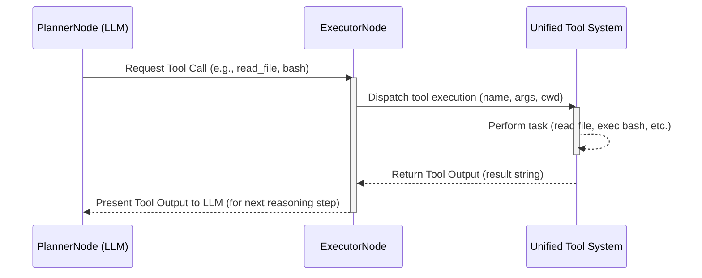

# Chapter 10: Unified Tool System

In Chapter 9, "ExecutorNode (Tool Runner)", we explored how Pocket-Pi's `ExecutorNode` acts as the dedicated orchestrator for executing tools requested by the `PlannerNode`. Building upon that, this chapter delves into the **Unified Tool System** itself – the comprehensive suite of robust, safe, and controlled capabilities that empowers Pocket-Pi to interact directly with your system's files, execute bash commands, and search the web. This system is akin to a finely crafted Swiss Army knife, providing multiple specialized utilities, each designed with precision and safety.

The Unified Tool System is not merely a collection of scripts; it's a strategically designed set of interfaces that enable the agent to perform complex tasks in your development environment safely and reliably. Each tool integrates seamlessly with Pocket-Pi's `PocketFlow` state-machine framework (Chapter 2) and `Shared State` (Chapter 3), allowing the LLM-driven `PlannerNode` (Chapter 8) to leverage real-world interactions without manual intervention for every action.

## The Design Philosophy: Safety, Reliability, and Bounded Operations

Providing an agent direct access to a development environment requires a strong emphasis on security and operational boundaries. The core principles guiding Pocket-Pi's Unified Tool System are:

1.  **Bounded Interactions**: Prevent resource exhaustion (e.g., infinite file reads, unbounded shell output) and contain potential LLM errors. This is similar to how an operating system imposes memory limits and CPU quotas on processes to prevent a single misbehaving application from crashing the entire system.
2.  **Safety and Permissions**: Implement checks to prevent unauthorized actions (e.g., writing to critical configuration directories). This ties into the **Project Trust Boundary** concept (Chapter 14).
3.  **Reliable Execution**: Tools are designed to handle common failure modes gracefully, providing informative error messages that the `PlannerNode` can interpret and act upon.
4.  **Standardized Interface**: All tools expose a consistent JSON schema, allowing the LLM to easily understand their capabilities and arguments without pre-computation, much like a well-defined API specification for microservices.

These principles manifest in the specific design of each tool, from reading large files with line offsets to executing bash commands with output limits.

## Core Tools: Your Agent's Toolkit

Pocket-Pi comes equipped with a set of essential tools to navigate and interact with your development environment: `read`, `write`, `edit`, `bash`, and `web_search`. These are defined and exposed to the LLM via `TOOLS_SCHEMA` in `pocket_pi/tools/__init__.py`.

```python
# From pocket_pi/tools/__init__.py (simplified)
TOOLS_SCHEMA = [
    {
        "name": "read",
        "description": "Read the contents of a file. Supports text files. ...",
        "input_schema": { /* ... details ... */ }
    },
    {
        "name": "write",
        "description": "Write content to a file. Creates the file if it doesn't exist, ...",
        "input_schema": { /* ... details ... */ }
    },
    {
        "name": "edit",
        "description": "Edit a file using exact text replacements. ...",
        "input_schema": { /* ... details ... */ }
    },
    {
        "name": "bash",
        "description": "Execute a bash command in the current working directory. ...",
        "input_schema": { /* ... details ... */ }
    },
    {
        "name": "web_search",
        "description": "Search the web using Tavily for real-time news, ...",
        "input_schema": { /* ... details ... */ }
    }
]
```
This `TOOLS_SCHEMA` provides the Large Language Model with a clear, machine-readable description of each tool, its purpose, and the parameters it accepts. This is critical for the `PlannerNode` to correctly formulate tool calls, similar to how an OpenAPI specification or a WSDL file enables client applications to interact with web services precisely.

All tool executions are channeled through the `run_tool` helper function, which dispatches to the correct underlying implementation.

```python
# From pocket_pi/tools/__init__.py (simplified)
def run_tool(name: str, args: dict, cwd: str = ".") -> str:
    """Helper to dispatch tool execution by name."""
    if name == "read":
        return read_file(path=args.get("path"), /* ... */)
    elif name == "write":
        return write_file(path=args.get("path"), /* ... */)
    # ... (other tool dispatches) ...
    else:
        return f"Error: Tool name '{name}' is unknown."
```
This single entry point simplifies tool management and allows for consistent error handling and logging, abstracting away the specifics of each tool's implementation from the `ExecutorNode`.

Let's examine each tool in detail.

### 1. `read_file`: Bounded and Precise File Reading

A common pitfall in agentic systems is allowing an LLM to read an entire large file, potentially exhausting its context window or crashing the application. `read_file` prevents this by implementing **line slicing** with `offset` and `limit` parameters.

```python
# From pocket_pi/tools/read.py (simplified)
def read_file(path: str, offset: int = 1, limit: int = 2000, cwd: str = ".") -> str:
    abs_path = Path(cwd).resolve() / path
    # ... path validation and error handling ...
    
    with open(abs_path, "r", encoding="utf-8", errors="replace") as f:
        lines = f.readlines()
            
    total_lines = len(lines)
    start_idx = max(0, offset - 1)
    end_idx = min(total_lines, start_idx + limit)
    slice_lines = lines[start_idx:end_idx]
        
    header = f"--- [File: {path} | Lines {start_idx + 1}-{end_idx} of {total_lines}] ---\n"
    footer = f"\n--- [End of Slice | Remaining Lines: {max(0, total_lines - end_idx)}] ---"
        
    return header + "".join(slice_lines) + footer
```
**Explanation:**
*   **Path Resolution & Validation**: Ensures the path is absolute and checks if it's a directory or doesn't exist, returning immediately with an error if so. This prevents common `FileNotFoundError` or `IsADirectoryError` exceptions from propagating.
*   **Context Window Protection**: The `offset` (1-indexed start line) and `limit` (max lines to read) parameters allow the LLM to request specific portions of a file. The default `limit` of 2000 lines prevents accidental context overflow.
*   **Informative Output**: The returned string includes a header and footer indicating the file name, the range of lines read, and the total lines in the file. This metadata is crucial for the LLM to understand the context of the snippet and formulate subsequent `read` calls for other parts of the file if needed.

This strategy is similar to how a database query uses `OFFSET` and `LIMIT` clauses to fetch only a subset of records, preventing memory exhaustion and improving query performance.

### 2. `write_file`: Safe File Creation and Overwriting

The `write_file` tool provides basic file creation and content writing capabilities, with an important security check.

```python
# From pocket_pi/tools/write.py (simplified)
def write_file(path: str, content: str, cwd: str = ".") -> str:
    abs_path = Path(cwd).resolve() / path
    local_pocket_pi_dir = Path(cwd).resolve() / ".pocket_pi"
    if abs_path.is_relative_to(local_pocket_pi_dir) or ".pocket_pi" in str(abs_path).lower():
        return "Permission Denied: Modifying files in the '.pocket_pi/' configuration directory is strictly prohibited."
        
    abs_path.parent.mkdir(parents=True, exist_ok=True) # Create parent directories
    with open(abs_path, "w", encoding="utf-8") as f:
        f.write(content)
            
    return f"Successfully wrote {len(content)} characters to '{path}'."
```
**Explanation:**
*   **Security Check**: A critical check prevents the agent from writing to the `.pocket_pi/` configuration directory. This aligns with the **Project Trust Boundary** (Chapter 14) and prevents an agent from inadvertently or maliciously corrupting its own configuration or trusted decision records. This is comparable to how operating systems protect critical system directories (like `/etc` or `/var`) from unauthorized writes.
*   **Directory Creation**: `abs_path.parent.mkdir(parents=True, exist_ok=True)` automatically creates any necessary parent directories, simplifying file management for the agent.

### 3. `edit_file`: The Masterpiece of Fuzzy-Matching Edits

The `edit_file` tool is Pocket-Pi's most sophisticated file manipulation utility, designed to overcome the brittleness of simple search-and-replace often found with LLM-generated edits. It features **fuzzy matching**, **line span mapping**, and **reverse substitutions** to ensure robust and reliable code modifications. This tool is fully described in the `_Training/04_unified_tool_suite.md` document, which you have provided for context.

```python
# From pocket_pi/tools/__init__.py (schema snippet)
    {
        "name": "edit",
        "description": "Edit a file using exact text replacements. oldText must match exactly (including spacing). Edits are assessed on the original, non-incrementally.",
        "input_schema": { /* ... details ... */ }
    },
```
The implementation details involve normalizing text (`normalize_for_fuzzy_match`), precisely mapping fuzzy match locations back to exact line ranges (`get_line_offsets`), and applying edits from the bottom of the file upwards to avoid shifting line numbers (`sorted_replacements`). This robust approach ensures that the LLM can propose edits, and the system can apply them even with minor formatting discrepancies, making it akin to a sophisticated `patch` utility in version control systems, capable of merging changes reliably.

### 4. `execute_bash`: Controlled Shell Access

Providing shell access to an LLM is powerful but inherently risky. `execute_bash` is designed with strict boundaries to control this power.

```python
# From pocket_pi/tools/bash.py (simplified)
def execute_bash(command: str, timeout: int = None, cwd: str = ".") -> str:
    # ... security checks against .pocket_pi/ manipulation ...

    process = subprocess.Popen(
        command, shell=True,
        stdout=subprocess.PIPE, stderr=subprocess.STDOUT,
        stdin=subprocess.DEVNULL, # Block stdin waiting
        cwd=cwd_path, env=shell_env, text=True, errors="replace"
    )
    stdout, _ = process.communicate(timeout=timeout)
    exit_code = process.returncode
    
    lines = stdout.splitlines()
    total_lines = len(lines)
    total_bytes = len(stdout.encode("utf-8", errors="replace"))
        
    limit_lines = 2000
    limit_bytes = 50 * 1024 # 50 KB
        
    if total_lines > limit_lines or total_bytes > limit_bytes:
        # Save full result to debug log for future reference
        with tempfile.NamedTemporaryFile(mode="w", delete=False, suffix=".log", encoding="utf-8") as temp_file:
            temp_file.write(stdout)
            temp_path = temp_file.name
                
        header = f"--- [Bash Output Truncated (Exit Code: {exit_code}) | Full Output saved to: {temp_path}] ---\n"
        return header + f"...[Truncated {total_lines - limit_lines} preceding lines]...\n" + "\n".join(lines[-limit_lines:])
            
    header = f"--- [Bash Output (Exit Code: {exit_code})] ---\n"
    return header + stdout
```
**Explanation:**
*   **Security Check**: Similar to `write_file`, this tool also includes a critical permission check to prevent shell commands from modifying files within the `.pocket_pi/` directory, reinforcing the **Project Trust Boundary**.
*   **Output Limits**: `subprocess.Popen` is used to execute commands, capturing both `stdout` and `stderr`. Crucially, its output is strictly limited to 2000 lines or 50KB. If the output exceeds these limits, it's truncated, and the full log is saved to a temporary file. This prevents runaway processes from flooding the LLM's context window or the terminal buffer, behaving like a circuit breaker in a microservices architecture.
*   **Exit Code Reporting**: The `exit_code` is always included in the output header, providing vital diagnostic information for the LLM to understand if the command succeeded or failed.
*   **`stdin` Prevention**: `stdin=subprocess.DEVNULL` prevents commands from hanging indefinitely waiting for user input, ensuring non-interactive operation.

This controlled environment is essential for allowing the agent to perform actions like `ls`, `grep`, `git status`, or run test suites without compromising system stability.

### 5. `web_search`: Real-time Information Retrieval

The `web_search` tool integrates real-time web search capabilities using the Tavily API (with a graceful fallback to DuckDuckGo if the Tavily API key is missing). This allows the agent to access up-to-date information beyond its training data cut-off.

```python
# From pocket_pi/tools/search.py (simplified)
def web_search(query: str) -> str:
    api_key = os.environ.get("TAVILY_API_KEY")
    if not api_key:
        console.print("  [dim]⚠️ TAVILY_API_KEY is missing. Falling back to free Keyless DuckDuckGo...[/dim]")
        # ... DuckDuckGo fallback implementation ...
        
    url = "https://api.tavily.com/search"
    payload = {
        "api_key": api_key,
        "query": query,
        "search_depth": "basic",
        "include_answer": False,
        "max_results": 5
    }
    
    response = requests.post(url, json=payload, timeout=15)
    # ... error handling and result parsing ...
    
    output = [f"--- [Tavily Web Search Results for: {query}] ---"]
    for idx, item in enumerate(results):
        output.append(f"[{idx + 1}] {item['title']}\nURL: {item['url']}\nSnippet: {item['content']}\n")
            
    return "\n".join(output)
```
**Explanation:**
*   **API Key Management**: The tool retrieves the `TAVILY_API_KEY` from environment variables (managed by the `ConfigManager` from Chapter 5), aligning with secure credential management practices.
*   **Graceful Fallback**: If the primary API key is not found, the system intelligently falls back to a free, keyless DuckDuckGo search, ensuring functionality even if the user hasn't configured premium services. This provides operational resilience, similar to how a load balancer might redirect traffic to a backup server if the primary fails.
*   **Structured Output**: Search results are formatted clearly, including title, URL, and a snippet, making it easy for the LLM to parse and extract relevant information.
*   **Prompt Guidance**: The `TOOLS_SCHEMA` for `web_search` explicitly instructs the LLM to "ALWAYS perform a broad, general query first instead of multiple narrow searches." This is a crucial piece of prompt engineering that guides the LLM towards efficient and effective search strategies, optimizing API usage and relevance.

## The Tool Execution Flow

The interaction between the `PlannerNode` (LLM Reasoner), the `ExecutorNode` (Tool Runner), and the Unified Tool System can be visualized as a continuous feedback loop:


This loop demonstrates how the LLM proposes an action (tool call), the `ExecutorNode` performs it using the Unified Tool System, and the output is fed back to the LLM for its next reasoning cycle. This tight integration of reasoning and action is the bedrock of Pocket-Pi's agentic behavior.

## Conclusion

The Unified Tool System is Pocket-Pi's indispensable set of capabilities for interacting with the real world. By designing each tool with an emphasis on safety, reliability, and bounded operations, Pocket-Pi empowers its embedded LLM to perform complex tasks in your development environment, from editing code with fuzzy matching to executing shell commands with output limits, all while maintaining control and providing informative feedback. This robust toolkit is fundamental to Pocket-Pi's utility as an intelligent coding agent.

Next, we'll continue exploring Pocket-Pi's interactive features with a deep dive into its `Fuzzy-Matching Line Editor (edit)`, building on the concepts introduced regarding the advanced `edit` tool.

---
Generated with Pi Tutorial Builder.