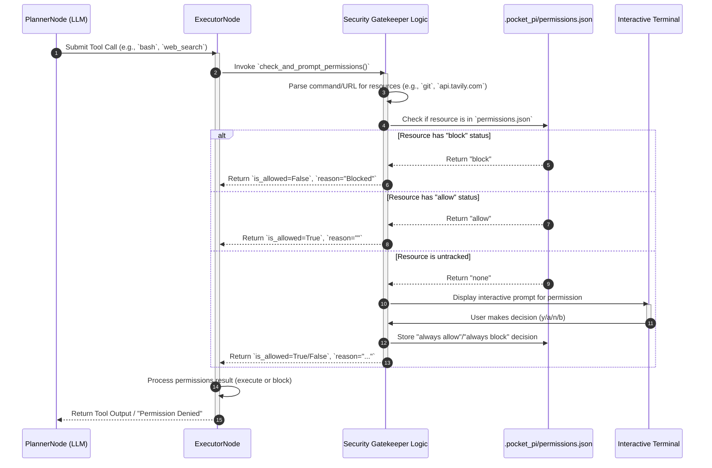

# Chapter 13: Security Gatekeeper (Human-In-The-Loop Permissions)

In Chapter 9, "ExecutorNode (Tool Runner)", we introduced Pocket-Pi's operational arm responsible for executing tools. We briefly touched upon the security measures embedded within its `prep()` phase. Now, we dedicate this chapter to a deep dive into that crucial component: the **Security Gatekeeper**, Pocket-Pi's human-in-the-loop permission system.

The Security Gatekeeper is Pocket-Pi's crucial safety mechanism, acting like a vigilant security guard. Before the agent executes any potentially risky action (like running a shell command or accessing a website), this gatekeeper intercepts the request. It checks if the action is pre-approved within the project's `.pocket_pi/permissions.json` file. If not, it pauses and asks you, the human, for explicit permission, ensuring that no unauthorized or unintended operations occur on your system.

Think of the Security Gatekeeper as an **in-kernel security monitor** or a **network firewall** integrated directly into Pocket-Pi's `PocketFlow` execution pipeline. Just as a modern operating system restricts direct hardware access, forcing applications to make controlled system calls, the Gatekeeper intercepts all potentially privileged agentic actions. It analyzes proposed operations, consults its Access Control List (ACL), and, if necessary, initiates a system-level interrupt—a pause in execution to query the human operator for authorization. This design eliminates the systemic risk of an autonomous agent performing destructive or unauthorized actions dueiding to hallucination or an untrusted external context.

## The Gatekeeper's Interception Architecture

The Security Gatekeeper is primarily implemented within the `ExecutorNode` (specifically its `prep` method) and supporting helper functions in `pocket_pi/workflow/nodes.py`. Its position in the `PocketFlow` ensures that security checks occur *before* any tool execution is attempted, providing a robust, fail-safe mechanism.

Here's a detailed sequence of how a tool call is processed through the Security Gatekeeper:



This sequence highlights the critical interception point: the `check_and_prompt_permissions` function, which is invoked for every tool call before the actual `run_tool` function is called.

## Dissecting the Gatekeeper's Mechanics

Let's break down the core functions that enable this human-in-the-loop security.

### 1. Dynamic Resource Extraction from Tool Arguments

Before querying permissions, the Gatekeeper must understand *what* is being requested. For `bash` commands, this involves parsing the command string to identify executables and potential network hosts.

```python
# From pocket_pi/workflow/nodes.py
def extract_commands_from_bash(command: str) -> List[str]:
    parts = re.split(r' \s*&& \s*| \s*\|\| \s*| \s*; \s*| \s*\| \s*|\n', command)
    cmds = []
    for part in parts:
        part = part.strip()
        if not part:
            continue
        # ... logic to extract command name (e.g., 'ls' from 'ls -la') ...
    return sorted(list(set(cmds)))

def extract_urls_from_bash(command: str) -> List[str]:
    from urllib.parse import urlparse
    pattern = r'https?://[^\s\'"]+'
    urls = re.findall(pattern, command)
    # ... logic to extract hostnames (e.g., 'api.example.com') ...
    return sorted(list(set(hosts)))
```
These functions, `extract_commands_from_bash` and `extract_urls_from_bash`, split complex shell commands (potentially chained with `&&`, `||`, `;`, or `|`) into individual components. `extract_commands_from_bash` uses `Path(c).name` to reliably get the executable name (e.g., `git` from `/usr/bin/git`). `extract_urls_from_bash` uses regular expressions and `urlparse` to pull out any hostnames. This granular parsing is essential for auditing, similar to how a packet inspection engine extracts protocol fields before applying firewall rules.

### 2. The `.pocket_pi/permissions.json` ACL

Permissions are stored on a per-project basis in `.pocket_pi/permissions.json`. This localized Access Control List (ACL) acts as the source of truth for approved or blocked actions within a specific codebase.

```json
{
  "commands": {
    "git": "allow",
    "rm": "block",
    "npm": "allow"
  },
  "urls": {
    "api.tavily.com": "allow",
    "evil.com": "block"
  }
}
```
This JSON file is loaded and parsed by the `check_and_prompt_permissions` function:

```python
# From pocket_pi/workflow/nodes.py (simplified)
def check_and_prompt_permissions(cwd: str, name: str, args: dict) -> Tuple[bool, str]:
    local_dir = Path(cwd).resolve() / ".pocket_pi"
    perm_file = local_dir / "permissions.json"
    
    perms = {"commands": {}, "urls": {}}
    if perm_file.exists():
        try:
            with open(perm_file, "r", encoding="utf-8") as f:
                perms = json.load(f)
        except Exception:
            # Handle corrupted JSON gracefully
            pass
            
    # ... logic to extract commands_to_check and urls_to_check ...
    
    for cmd in commands_to_check:
        status = perms["commands"].get(cmd)
        if status == "block":
            return False, f"Permission Denied: Command '{cmd}' is blocked."
        elif status == "allow":
            continue
        # If status is None (untracked), then prompt the user
        else:
            decision = prompt_gatekeeper_choice("Command", cmd)
            # ... update perms and save to file based on decision ...
        
    for url in urls_to_check:
        status = perms["urls"].get(url)
        # ... similar logic for URLs ...
            
    return True, ""
```
The function first attempts to load existing permissions. For each extracted command or URL, it checks if an explicit "allow" or "block" status exists. If a resource is listed as "block", the function immediately returns `False`, preempting execution. This is akin to a firewall's explicit deny rules taking precedence over implicit allow rules.

### 3. Interactive TTY Verification and Persistent Decisions

When an untracked command or URL is encountered, the Gatekeeper pauses execution and engages the user directly via the terminal. This interaction uses the `prompt_gatekeeper_choice` function.

```python
# From pocket_pi/workflow/nodes.py (simplified)
def prompt_gatekeeper_choice(category: str, item: str) -> str:
    prompt_lines = [
        f" • [bold]Type:[/bold] [cyan]{category}[/cyan]",
        f" • [bold]Resource:[/bold] [cyan]{item}[/cyan]",
        "",
        " [bold]How would you like to handle this request?[/bold]",
        " [bold green]y[/bold] = Allow once",
        " [bold green]a[/bold] = Always allow in this project",
        " [bold red]n[/bold] = Block once",
        " [bold red]b[/bold] = Always block in this project",
    ]
    # ... rich.console.print for the beautifully styled prompt ...
    
    if not sys.stdin.isatty():
        # Handle non-interactive environments (e.g., CI/CD pipelines)
        console.print("[yellow]Non-interactive terminal detected. Defaulting to: Block once.[/yellow]")
        return "block_once"
        
    while True: # Loop until valid input
        choice = input("Select option (y/a/n/b): ").strip().lower()
        # ... validate 'choice' and return appropriate action string ...
```
This interactive prompt blocks the `PocketFlow`'s execution thread, similar to how a `sudo` command pauses to request a password. It provides four options:
*   `y` (Allow once): Grants temporary permission for the current operation. The entry is *not* saved to `permissions.json`.
*   `a` (Always allow): Persistently records `"allow"` for this resource in `permissions.json`, preventing future prompts.
*   `n` (Block once): Prevents the current operation.
*   `b` (Always block): Persistently records `"block"` for this resource, ensuring it never runs in this project.

Decisions to "always allow" or "always block" are immediately persisted to `permissions.json` using the `save_permissions` helper, analogous to committing a new rule to a firewall configuration.

### 4. Write Protection: Defeating Self-Modification Attacks

A sophisticated agent, especially one facing unknown or malicious code, might attempt to "write-tunnel" by modifying its own permission files (e.g., executing `echo '{"commands": {"rm": "allow"}}' > .pocket_pi/permissions.json`). Pocket-Pi deploys a hardcoded **Write Shield** inside the underlying `bash` and `write` tools to prevent this:

```python
# From pocket_pi/tools/bash.py (simplified)
def execute_bash(command: str, timeout: int = None, cwd: str = ".") -> str:
    # ...
    # Guard against model attempts to alter security configs
    if ".pocket_pi" in command.lower():
        for forbidden in [">", "rm ", "mv ", "chmod ", "tee "]:
            if forbidden in command.lower():
                return "Permission Denied: Modifying config is blocked."
    # ...
```
This explicit check occurs *within the tool execution logic itself*, outside the immediate control of the `PlannerNode` or `ExecutorNode`. It ensures that attempts to write to or modify the `.pocket_pi/` directory (which contains sensitive configuration and permission data) through specific shell commands are *always* blocked, regardless of any *explicit* permission granted. This hardcoded barrier acts as a root trust anchor, protecting the integrity of the agent's security policies.

## Integration with Error Handling

If the Gatekeeper blocks an action, the `ExecutorNode.exec()` method intercepts this `blocked_reason`.

```python
# From pocket_pi/workflow/nodes.py (ExecutorNode.exec - simplified)
    def exec(self, data):
        results = []
        for tc in data["tool_calls"]:
            # ...
            blocked_reason = tc.get("blocked_reason") # Set by check_and_prompt_permissions
            
            if blocked_reason:
                console.print(f"\n[bold red]🛑 Gatekeeper: Blocked Tool Call [/bold red][bold cyan]'{name}'[/bold cyan]")
                output = blocked_reason # The reason becomes the output
            else:
                # ... actual run_tool() call ...
                
            results.append({"toolCallId": tc_id, "toolName": name, "output": output})
        return results
```
The `blocked_reason` becomes the "output" for that tool call, allowing the `PlannerNode` (upon its next cycle) to observe that the tool failed due to a permission issue. This provides valuable feedback to the LLM, enabling it to re-plan or inform the user about the security constraint, rather than encountering an unexpected error. This is crucial for transparent and robust error diagnostics in an agentic system.

## Conclusion

The Security Gatekeeper is more than just a feature; it's a fundamental design principle ensuring Pocket-Pi operates within clearly defined safety parameters. By enforcing human-in-the-loop validation for potentially risky actions, maintaining a persistent, per-project ACL, and protecting its own configuration from tampering, Pocket-Pi provides a robust, transparent, and user-controlled environment. This ensures that the power of an autonomous agent is harnessed responsibly, without compromising the integrity or security of your local development environment. It's an essential safeguard for building trust in agentic systems, transforming Pocket-Pi from a mere scripting engine into a trusted collaborator.

With the security of our project boundary now solid, we will explore the comprehensive implications of this context in the next chapter. We will delve into the broader concept of the **Project Trust Boundary**, examining its relationship with the `ConfigManager` and `SessionManager`, and how it forms the secure perimeter within which Pocket-Pi operates.

---
Generated with Pi Tutorial Builder.